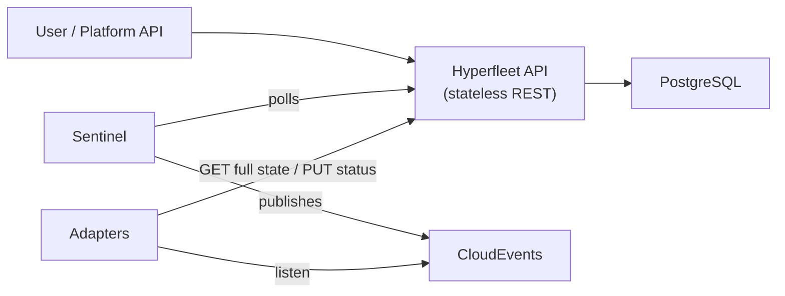
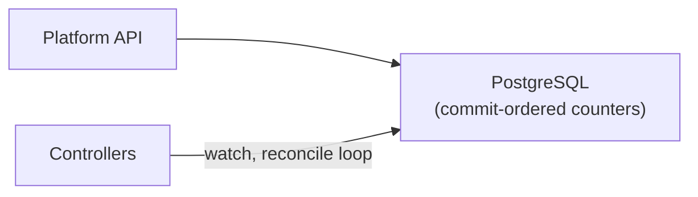

# Architecture Comparison: Hyperfleet-API (CLM) vs. Direct-to-Postgres

## System Overview

**Current (CLM pattern):**

**Proposed (direct-to-Postgres):**

---

## 1. Reliability

### Failure Modes & Recovery

| Dimension                               | Hyperfleet-API (CLM)                                                                                                                                              | Direct-to-Postgres                                                                                                                                                                       |
| --------------------------------------- | ----------------------------------------------------------------------------------------------------------------------------------------------------------------- | ---------------------------------------------------------------------------------------------------------------------------------------------------------------------------------------- |
| **Component count in write path**       | 3-4 (API caller -> API server -> GORM -> PG)                                                                                                                      | 2 (controller -> PG, single atomic txn)                                                                                                                                                  |
| **Component count in reconcile loop**   | 5+ (Sentinel polls API -> CloudEvent -> Adapter fetches full state from API -> Adapter acts -> Adapter PUTs status to API)                                        | 2 (controller watches PG -> controller acts -> controller writes PG)                                                                                                                     |
| **Postgres failure**                    | API returns 500s; Sentinel/Adapters retry. No concurrency control -- concurrent reconnects may race                                                               | Writers block with backpressure (never skip). Timeline epoch forces watchers to relist (I3/I5)                                                                                           |
| **Intermediate service failure**        | If the API goes down, Sentinel can't poll, Adapters can't read or report status -- **full stop** on all reconciliation until API recovers                         | No intermediate service; only PG availability matters                                                                                                                                    |
| **Split-brain / zombie writers**        | No mechanism -- two API replicas can write the same resource concurrently; GORM has no version checking                                                           | Optimistic concurrency (I6): every write checks `object_version`; stale writers get 409 Conflict. Timeline epochs (I4) force relist after failover                                       |
| **Event ordering**                      | CloudEvents are "anemic" (ID + generation only); Adapters fetch full state. No sequence guarantee -- Sentinel polls on a cadence and may miss intermediate states | Commit-ordered per-(GVK, bucket) sequence (I1). Watchers see every committed state-change in commit order. Poll-primary ensures delivery even under total LISTEN/NOTIFY failure (I3)         |
| **Lost events**                         | If a CloudEvent is lost (Sentinel -> broker -> Adapter), the resource stalls until the next Sentinel poll cycle discovers it's unreconciled                       | Poll-primary watch: events are pulled from the DB, not pushed. Doorbell (pg_notify) is latency-only. 5s baseline poll = hard upper bound on delivery delay under total notification loss |
| **Consistency model**                   | READ operations run outside transactions (no isolation). List `total` can be inconsistent with `items` under concurrent deletes (documented as "cosmetic")        | List runs under `REPEATABLE READ` snapshot. resourceVersion is consistent with data -- built from the same snapshot (I4/I5). No skew window                                              |
| **Optimistic concurrency**              | `generation` counter increments on spec change; no version check on write path (PATCH does not check generation)                                                  | `object_version` checked on every write (I6). 409 Conflict on stale version. Counter increment rolls back (I1)                                            |
| **Failover data loss**                  | Depends on PG replication config (not specified in the design). If async, acknowledged writes can be lost                                                         | Synchronous Multi-AZ standby: **zero acknowledged-write loss** by construction. Writer tripwire detects sequence regression post-failover                                                |
| **Continuous correctness verification** | None -- correctness is tested pre-deployment only                                                                                                                 | Production verifier (O(buckets) state) continuously checks I2/I4/I5 on sampled buckets. Canary writer measures write-to-delivery latency                                                 |

### Reliability Verdict

The direct-to-Postgres design is significantly more reliable because:

1. **Fewer failure domains.** Every intermediate service (API server, Sentinel, message broker) is a potential failure point. Removing them removes entire classes of outage.

2. **Formal correctness guarantees.** Every write checks `object_version` for optimistic concurrency (409 on stale). Commit-ordered per-bucket sequences ensure watchers never miss an event.

3. **No event loss by construction.** The CLM pattern relies on push (CloudEvents) with poll-based fallback (Sentinel). If either mechanism fails, reconciliation stalls. The Postgres pattern's poll-primary watch means events are never "sent" -- they're rows in the database, read when the watcher polls. You can't "lose" a row.

4. **Snapshot-consistent reads.** The CLM's list-without-transaction pattern creates real (if rare) consistency anomalies. The Postgres design's `REPEATABLE READ` snapshots eliminate this class of bug entirely.

5. **Tested invariants.** 15 deterministic race tests + continuous production verifier vs. standard unit/integration tests.

---

## 2. Performance

### Write Path

| Metric                    | Hyperfleet-API (CLM)                                                                                                | Direct-to-Postgres                                                                                                                                                  |
| ------------------------- | ------------------------------------------------------------------------------------------------------------------- | ------------------------------------------------------------------------------------------------------------------------------------------------------------------- |
| **Write hops**            | HTTP request -> JSON parse -> GORM -> SQL -> PG                                                                     | Single stored procedure call (`pgctl_write()`: suppress + counter + upsert) + external doorbell                                                                     |
| **Latency (write)**       | HTTP overhead + GORM reflection + connection pool wait. 30s request timeout under pressure; 500s on pool exhaustion | p50=28ms, p99=211ms (single bucket); p50=18ms, p99=45ms (16 buckets). Measured with 50 concurrent writers                                                           |
| **Throughput ceiling**    | Not published. Connection pool: 50 max open (default). Transaction-per-write-request middleware                     | **9,622 writes/s** across 64 buckets on RDS db.m6g.2xlarge (Multi-AZ sync commit); near-linear scaling with bucket count. Zero serialization failures               |
| **No-op suppression**     | None -- every PATCH/PUT hits the database regardless of whether content changed                                     | Content-equal writes consume no sequence, no version bump, no doorbell, no watch event. Critical for status re-appliers that rewrite identical content periodically |
| **Connection efficiency** | 50 max connections shared across all HTTP requests (reads + writes). PgBouncer sidecar optional                     | pgx pool of 4-8 connections. ~20 total connections for the entire fleet                                                                                             |

### Read Path

| Metric                   | Hyperfleet-API (CLM)                                                                                                                         | Direct-to-Postgres                                                                                                                                       |
| ------------------------ | -------------------------------------------------------------------------------------------------------------------------------------------- | -------------------------------------------------------------------------------------------------------------------------------------------------------- |
| **Read model**           | HTTP GET -> GORM query (no transaction). Status conditions synthesized per-request from `adapter_statuses` table                             | Direct PG read (~1-5ms). Or controller-runtime cache fed by watch stream (~0ms, up to 5s stale)                                                          |
| **List performance**     | GORM with pagination. Count and items are separate queries (no snapshot consistency)                                                         | Single `REPEATABLE READ` txn: epoch + counters + filtered scan (excludes fully-deleted tombstones, includes dying objects with finalizers)               |
| **Watch/event delivery** | Sentinel polls API periodically -> publishes CloudEvent -> Adapter GETs full state from API. **Three network hops minimum** per state change | Single-goroutine poll on PG index every 5s (or ~100ms with doorbell). **Zero network hops beyond PG**                                                    |
| **Watch fan-out**        | Every event requires Adapter to `GET` full resource from API -- **N adapters = N reads per event**                                           | Watchers read directly from PG index. Coalescing is free (latest seq per object). N controllers = N poll queries, but each is a cheap indexed range scan |

### End-to-End Reconciliation Latency

| Phase                           | Hyperfleet-API (CLM)                                                                                                     | Direct-to-Postgres                                                |
| ------------------------------- | ------------------------------------------------------------------------------------------------------------------------ | ----------------------------------------------------------------- |
| **Spec change -> detection**    | Sentinel poll interval (configurable, likely seconds to minutes)                                                         | Doorbell: ~100ms typical; poll fallback: <=5s                     |
| **Detection -> adapter action** | CloudEvent publish + delivery + Adapter GET from API                                                                     | Controller reconcile loop (already watching)                      |
| **Action -> status visible**    | Adapter PUT to API -> API writes DB -> next Sentinel poll picks up new state                                             | Controller WriteStatus() -> same PG, same watch stream            |
| **Total round-trip**            | Sentinel poll + event delivery + Adapter processing + status report + Sentinel re-poll = **multiple seconds to minutes** | Watch delivery + reconcile + WriteStatus = **sub-second typical** |

### Performance Verdict

The direct-to-Postgres design is substantially faster:

1. **Latency:** Eliminates 2-3 network hops per operation. Write latency is measured in tens of milliseconds, not hundreds.

2. **Throughput:** 9,622 writes/s measured on RDS db.m6g.2xlarge (Multi-AZ sync commit, 64 buckets) vs. an unquantified CLM throughput bounded by HTTP overhead and connection pool limits.

3. **Connection efficiency:** 20 connections for the entire fleet vs. 50 per API replica -- critical at scale.

4. **No-op suppression:** The single biggest performance optimization. The CLM pattern has no equivalent; every adapter status report is a full write regardless of whether anything changed. At fleet scale this difference is enormous.

5. **Event delivery:** Direct DB poll vs. multi-hop Sentinel -> CloudEvent -> Adapter -> API cycle. The latency difference is 100ms vs. seconds-to-minutes.

---

## 3. Trade-offs Favoring the CLM Pattern

The CLM pattern isn't without advantages:

| Advantage                    | CLM Pattern                                                                                          | Direct-to-Postgres                                                                     |
| ---------------------------- | ---------------------------------------------------------------------------------------------------- | -------------------------------------------------------------------------------------- |
| **Simplicity for consumers** | Standard REST API with OpenAPI spec, Swagger UI, curl-testable                                       | Requires controller-runtime integration; not a general-purpose API                     |
| **Horizontal scaling**       | Stateless API replicas scale trivially behind a load balancer                                        | Writers are bucket-scoped; max controller replicas = bucket count (16 default)         |
| **Decoupling**               | Adapters need only HTTP + CloudEvents -- polyglot-friendly                                           | Controllers must speak pgx and understand storage semantics                            |
| **Operational familiarity**  | Standard REST service + GORM -- well-understood ops model                                            | Novel storage layer with custom invariants; requires specialized operational knowledge |
| **Schema flexibility**       | GORM migrations + plugin system for generic entities                                                 | Fixed schema per DESIGN.md; changes require understanding invariant implications       |
| **Existing ecosystem**       | Sentinel, Adapters, authentication, search (TSL queries), audit trails, OpenAPI validation all exist | Would need to be rebuilt or adapted for the new architecture                           |

---

## 4. Summary

| Dimension                                 | Winner               | Magnitude                                                 |
| ----------------------------------------- | -------------------- | --------------------------------------------------------- |
| **Reliability -- data correctness**       | Direct-to-Postgres   | Large. Formal invariants vs. convention-based             |
| **Reliability -- failure recovery**       | Direct-to-Postgres   | Large. Fewer components, zero-loss failover, self-healing |
| **Reliability -- split-brain protection** | Direct-to-Postgres   | Critical. CLM has none                                    |
| **Performance -- write latency**          | Direct-to-Postgres   | ~5-10x (tens of ms vs. hundreds)                          |
| **Performance -- event delivery**         | Direct-to-Postgres   | ~10-100x (100ms vs. seconds-minutes)                      |
| **Performance -- connection efficiency**  | Direct-to-Postgres   | ~5-10x fewer connections                                  |
| **Performance -- no-op suppression**      | Direct-to-Postgres   | CLM has no equivalent                                     |
| **Operational simplicity**                | CLM (Hyperfleet-API) | Moderate. Standard REST patterns                          |
| **Consumer accessibility**                | CLM (Hyperfleet-API) | Moderate. HTTP + curl vs. pgx                             |
| **Ecosystem maturity**                    | CLM (Hyperfleet-API) | Significant. Already built and deployed                   |

**Bottom line:** The direct-to-Postgres design is dramatically better on reliability and performance -- the two primary evaluation dimensions. The CLM pattern's advantages are real but are primarily about operational familiarity and consumer convenience, not about the quality of the system under load or failure. The formal invariant catalog, deterministic race tests, and continuous production verifier in the Postgres design represent a qualitative leap in correctness assurance that the CLM pattern simply doesn't attempt.
