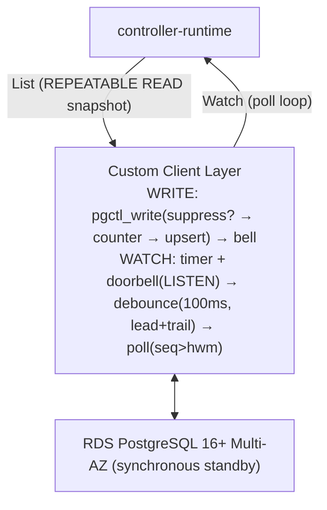

# High-Performance Postgres-Backed Control Plane — Design & Hardening Plan (v4)

**Status:** Proposed · **Platform:** AWS RDS PostgreSQL 16+ Multi-AZ (single region) · **Supersedes:** v3
**Prime directive:** correctness first. Every mechanism in this document is justified by a named invariant, every invariant has a named attack (race/failure), and every attack has a named test. Performance targets are retained but subordinate.

**Change from v3:** the design (§3) is carried forward essentially unchanged — poll-primary watch, doorbell as latency-only optimization, per-(GVK, bucket) commit-ordered counters, timeline epochs, tombstone compaction. v4 adds: a formal invariant catalog (§2), a spec/status split (§3.3b), a race-condition catalog with deterministic tests (§5), a continuous production invariant verifier (§6), and an expanded certification plan (§7). Sizing defaults to the 5,000-cluster tier with an in-place scale-up path to 50,000 (§4).

---

## 1. Problem Statement

etcd imposes an ~8 GB practical ceiling and a single raft group; for a regional fleet control plane at 5,000+ managed clusters it is an operational bottleneck. Moving storage to PostgreSQL creates three synchronization hazards for controller-runtime's List/Watch engine:

1. **Out-of-order commits.** With naive sequences, a transaction can take sequence N but commit after N+1; a watcher tracking sequences advances past N and misses it forever.
2. **Shard affinity.** Parent-child co-location (NodePool in its Cluster's bucket) requires per-shard sequences without a global write lock.
3. **Failover sequence regression.** A commit-ordered counter is only trustworthy if failover can never lose an acknowledged commit; otherwise the promoted node re-issues consumed sequence numbers — same sequence, different payload — silently corrupting every downstream cache.

The system must deliver commit-ordered event streams per (GVK, bucket); survive unplanned failover with zero committed-write loss; and never make event delivery depend on a push mechanism.

## 2. Correctness Invariants

These are the properties the system promises. Everything else exists to uphold them.

- **I1 — Commit-ordered sequences.** Within a (GVK, bucket), if seq(A) < seq(B) then A committed before B became visible. No watcher can observe B while A is still invisible. (Aborted transactions leave no hole because the counter increment rolls back with them.)
- **I2 — No regression.** `current_seq` for any (GVK, bucket) never decreases — across crashes, failovers, promotions, restores. `(timeline_epoch, seq)` is strictly monotonic even in disaster scenarios.
- **I3 — Exactly-once delivery per state.** A watcher starting from resourceVersion RV receives every object state-change with seq > RV exactly once (coalescing rapid updates to the latest state per object is permitted — Kubernetes watch semantics), with no duplicates and no losses, regardless of doorbell behavior.
- **I4 — RV monotonicity.** The composite resourceVersion observed by any client never moves backwards, including across failover.
- **I5 — Compaction safety.** A watcher can never silently skip a compacted event: if its RV predates the compaction horizon for any bucket, it receives `410 Gone` and relists; otherwise its stream is complete.
- **I6 — Optimistic concurrency.** An update presenting a stale `object_version` is rejected (409); no lost updates on a single object.

**Not provided:** Owner-reference garbage collection is intentionally left to controllers. In Kubernetes, the API server's GC cascade-deletes dependents when their owner is removed; here, controllers handle this via standard controller-runtime patterns (`Owns()` watches + finalizer-driven cleanup). This keeps the storage layer simple — no cross-object graph traversal.

## 3. Architectural Design



### 3.1 Schema

```sql
-- 1. Commit-ordered sequence per (bucket, GVK)
CREATE TABLE gvk_bucket_counters (
    bucket_id   INT    NOT NULL,
    gvk         TEXT   NOT NULL,
    current_seq BIGINT NOT NULL DEFAULT 0,
    PRIMARY KEY (bucket_id, gvk)
) WITH (fillfactor = 50);          -- hottest rows in the system: keep updates HOT

-- 2. Resources: one row per object. Three lifecycle states:
--    live (deletion_timestamp IS NULL),
--    dying (deletion_timestamp set, has finalizers — still visible to controllers),
--    fully deleted / tombstone (deletion_timestamp set, no finalizers — compactable).
CREATE TABLE kubernetes_resources (
    gvk                TEXT NOT NULL,
    namespace          TEXT NOT NULL,
    name               TEXT NOT NULL,
    uid                UUID NOT NULL DEFAULT gen_random_uuid(),
    bucket_id          INT NOT NULL,
    gvk_bucket_seq     BIGINT NOT NULL,
    object_version     BIGINT NOT NULL DEFAULT 1,
    spec               JSONB NOT NULL,
    status             JSONB NOT NULL,
    metadata           JSONB NOT NULL,
    deletion_timestamp TIMESTAMPTZ NULL,
    created_at         TIMESTAMPTZ DEFAULT now(),
    updated_at         TIMESTAMPTZ DEFAULT now(),
    PRIMARY KEY (gvk, namespace, name)
);

CREATE INDEX idx_resources_list
    ON kubernetes_resources (gvk, bucket_id)
    WHERE deletion_timestamp IS NULL;                 -- Covers live-only queries (not used by List, which returns all states)
CREATE INDEX idx_resources_watch
    ON kubernetes_resources (gvk, bucket_id, gvk_bucket_seq);  -- Poll: ordered range

-- 3. Failover epoch (written by promotion init hook)
CREATE TABLE cluster_epoch (
    singleton   BOOL PRIMARY KEY DEFAULT TRUE CHECK (singleton),
    timeline_id BIGINT NOT NULL
);

-- 4. Compaction horizon per (bucket, GVK)
CREATE TABLE compaction_horizon (
    bucket_id     INT    NOT NULL,
    gvk           TEXT   NOT NULL,
    compacted_seq BIGINT NOT NULL,
    PRIMARY KEY (bucket_id, gvk)
);

```

### 3.2 Composite resourceVersion

`e7|b2:1044,b5:902,b9:4123` — timeline epoch prefix + per-bucket high-water map. Serialization is canonical (buckets sorted ascending) so equal states compare equal. Upholds **I2/I4**: the epoch increments on every promotion, so `(epoch, seq)` is monotonic even if a sequence were somehow rewound. Stale epoch or sub-horizon seq → `410 Gone` (**I5**).

### 3.3 Atomic Write Path — Stored Procedure

The write path uses a server-side stored procedure `pgctl_write()` that performs no-op suppression, counter increment, and upsert in a single server-side call. The doorbell (`pg_notify`) fires **after** the transaction commits, outside the procedure, to avoid the global notification-queue lock that would serialize all concurrent commits.

```sql
-- Steps (a)–(b) run inside the stored procedure, in one transaction.
BEGIN;
SELECT * FROM pgctl_write(
    $gvk, $ns, $name, $bucket,
    $expected_version,
    $force_write,       -- TRUE bypasses no-op suppression
    $spec, $status, $metadata, $deletion_ts
);
-- Returns: (uid, object_version, seq, changed)
-- changed=FALSE means no-op suppression fired — no counter, no upsert.
COMMIT;

-- (c) DOORBELL — fires only when changed=TRUE.
-- Outside the transaction to avoid the global notification-queue lock.
-- Lost doorbells are harmless — watchers have baseline polling as fallback.
SELECT pg_notify('resource_changes_b' || $bucket, '');
```

Inside `pgctl_write()`, the steps are:

**Tombstone revival:** A create that hits `unique_violation` may be blocked by a tombstone awaiting compaction. The write path attempts to revive it: `UPDATE ... SET uid = gen_random_uuid(), object_version = 1, deletion_timestamp = NULL ... WHERE deletion_timestamp IS NOT NULL AND (no finalizers)`. A fresh UID ensures watchers and owner references treat this as a new object. If the blocking row is live or dying (has finalizers), the UPDATE matches zero rows and the write returns `AlreadyExists`. The counter increment from step (b) survives the failed INSERT via PL/pgSQL's implicit savepoint (stored proc) or an explicit `SAVEPOINT` (multi-statement path).

**(a) SUPPRESSION CHECK** — upholds I1/I3. PK-read the existing row; if content is identical (see §3.3c), return `(uid, version, 0, false)` immediately — no counter increment, no upsert.

**(b) SEQUENCE + UPSERT** — upholds I1/I6. The counter `INSERT ... ON CONFLICT DO UPDATE SET current_seq = current_seq + 1` takes an exclusive row lock, serializing commit order with sequence order. The upsert checks `object_version = $expected_version`; zero rows ⇒ `RAISE EXCEPTION` with `P0002` (409 Conflict). A version conflict rolls back the entire stored procedure call, including the counter increment — the counter increment rolls back with the transaction.

Client rules: errors raised inside `pgctl_write()` abort the transaction automatically (no partial state). Any ambiguous commit outcome (connection dropped mid-COMMIT) is resolved by reading back the row and `current_seq` before retrying — the write is idempotent to verify because `object_version` and seq identify it.

**Why a stored procedure:** collapsing three round-trips (suppress, counter, upsert) into one server-side call eliminates two network round-trips per write. Combined with moving `pg_notify` outside the transaction (which eliminates the global notification-queue lock that serialized all concurrent commits), this improved per-bucket throughput by ~41% and enabled near-linear multi-bucket scaling.

### 3.3b Status Write Path (Spec/Status Split)

In Kubernetes, spec (desired state) and status (observed state) are written by different controllers — e.g., the API server writes spec while a controller writes status. The system supports this with a `WriteStatus` path that uses the **same `pgctl_write()` stored procedure** (§3.3). The differences are:

1. **UPDATE only touches `status`** — `spec`, `metadata`, and `deletion_timestamp` are unchanged. There is no create path; the object must already exist (`ExpectedVersion > 0`).
2. **Same shared counter and `object_version`.** Both `Write()` and `WriteStatus()` increment the same `gvk_bucket_counters` row and bump the same `object_version` column on `kubernetes_resources`. This ensures watchers see a single commit-ordered event stream covering both spec and status changes.
3. **No-op suppression compares only `status`** (not all four content fields). See §3.3c.

The call pattern is identical to §3.3 — `pgctl_write(...)` in a transaction, doorbell after commit if `changed=TRUE`. A spec writer and a status writer can operate concurrently on the same bucket — the counter's exclusive row lock serializes sequence issuance (I1).

**Symmetric `WriteObject` path:** `WriteObject` mirrors `WriteStatus` — it updates only `spec`, `metadata`, and `deletion_timestamp`, leaving `status` untouched. This is the write path used by controller-runtime's `client.Update()` (via pgruntime), matching the Kubernetes API server's behavior where `Update` writes spec + metadata only. `WriteObject` passes `null` for the status parameter; the stored procedure uses `COALESCE(p_status, status)` to preserve the existing status column. Like `WriteStatus`, `ExpectedVersion` must be > 0 (no create path).

### 3.3c No-Op Write Suppression

Content-equal writes consume no sequence number, emit no doorbell, and bump no `object_version`. This matches Kubernetes API-server semantics where an update that changes nothing does not advance resourceVersion. The feature is default-on; callers set `ForceWrite: true` to bypass it.

**Mechanism:** inside `pgctl_write()`, before the counter increment, the stored procedure reads the existing row by primary key. If the row exists and all compared fields are equal to the incoming values, the procedure returns `(uid, version, 0, false)` immediately — no counter increment, no upsert. The caller sees `changed=FALSE` and skips the doorbell.

**Field comparison rules (inside `pgctl_write()`):**

- `Write()` compares all four content fields: `spec`, `status`, `metadata`, `deletion_timestamp`. JSONB equality (`=`) is key-order-insensitive; timestamp comparison uses `time.Equal()` to handle timezone normalization.
- `WriteObject()` (null status parameter) compares `spec`, `metadata`, and `deletion_timestamp` (not `status`). The stored procedure handles null status via `(p_status IS NULL OR v_existing.status = p_status)` in the suppression check.
- `WriteStatus()` compares only `status`.

**Create-path behavior (ExpectedVersion == 0):** if the row already exists and content matches, the write is treated as a replayed create — returns `Changed: false` with the existing row's version and UID. If content differs, returns `ErrAlreadyExists` as before.

**`WriteResult.Changed`** indicates whether the write produced a new state. Callers can use this to skip downstream side-effects on no-ops.

**Invariants preserved:**

- **I1 (commit ordering):** suppressed writes don't touch the counter — no ordering concern.
- **I3 (exactly-once delivery):** no event emitted for no state change — correct Kubernetes semantics.
- **I6 (optimistic concurrency):** content-equal ⇒ intent satisfied regardless of version.

**Performance:** one additional PK read per write inside the stored procedure. Under load tests with unique content per write (suppression finds "no match" and proceeds normally), no measurable regression.

### 3.4 List

Single `REPEATABLE READ` transaction: read `cluster_epoch` + counters (build RV), then live and dying resource rows ordered by `(bucket_id, gvk_bucket_seq)`, COMMIT. Fully-deleted tombstones (deletion_timestamp set, no finalizers) are excluded by the query: `AND (deletion_timestamp IS NULL OR metadata->'finalizers' != '[]'::jsonb)`. Dying objects (deletion_timestamp set, has finalizers) are included so controllers can perform cleanup — matching the Kubernetes API server's finalizer contract. Snapshot and RV are the same instant — no skew window (supports I3/I4 handoff into Watch).

### 3.4b Read Model: Direct Reads vs. Cached Reads

`Client.Get()` reads directly from PostgreSQL on every call — no in-memory cache. This differs from standard controller-runtime, where `Get()` inside a `Reconcile` reads from an informer cache populated by the List/Watch stream.

**Why direct reads are the default:** Controllers with low read rates (a handful of objects per reconcile cycle, not thousands) benefit from simpler code that always returns committed state, avoiding a class of staleness bugs. The `ListerWatcher` already feeds the watch stream for event-driven reconciliation; `Get()` is a point-read for the current object, not a scan.

**When to consider a cached model:** If reconcilers perform many `Get()` calls per cycle, or if multiple informers share the same `ListerWatcher`, wiring it into controller-runtime's standard cache reduces DB load and read latency. The `ListerWatcher` already implements the List/Watch contract, so the integration is mechanical — the hard part (commit-ordered, exactly-once event stream) is already done.

**Trade-offs:**

|              | Direct reads (current)                | Cached reads                                                  |
| ------------ | ------------------------------------- | ------------------------------------------------------------- |
| Read latency | ~1–5ms (Postgres round-trip)          | ~0ms (memory)                                                 |
| Freshness    | Always committed state                | Up to one poll interval stale (5s worst case, ~100ms typical) |
| DB load      | One query per `Get()`                 | Zero read queries from reconcilers                            |
| Memory       | None beyond the connection            | Full working set in memory per controller                     |
| Complexity   | Simpler — no cache coherence concerns | Requires trusting the watch stream entirely                   |

For conflict resolution and ambiguous-commit read-back, the direct `Get()` (or `ReadBack`) is always needed regardless of the read model — those paths require the live database value.

### 3.5 Watch — Single-Goroutine Poll-Primary with Doorbell

Polling is the correctness mechanism (**I3**); the doorbell only changes _when_ a poll happens.

**Poll cycle** per (GVK, bucket): a single **REPEATABLE READ read-only transaction** per poll cycle covers the epoch check, per-bucket compaction horizon checks, and all row queries. This snapshot isolation means mid-poll compaction is invisible (B3 defense). `SELECT ... WHERE gvk=$1 AND bucket_id=$b AND gvk_bucket_seq > $hwm ORDER BY gvk_bucket_seq ASC` (served by `idx_resources_watch`, no sort). Dispatch Added/Modified/Deleted (`deletion_timestamp` set ⇒ Deleted); advance the high-water mark per row. The client layer (e.g., pgruntime) further classifies Deleted events based on finalizer state: objects with active finalizers dispatch OnUpdate (the object is dying but still visible to controllers), while objects with no finalizers dispatch OnDelete (the object is fully gone). Rapid updates to one object coalesce naturally — the delivered sequence numbers are not contiguous under coalescing, which is correct Kubernetes watch semantics (I3).

**Single-goroutine scheduler** — one loop owns all polling, one timer, and local state (`lastPoll`, `doorbellPending`). The listen goroutine only forwards notifications into a 1-buffered channel; it uses a child context that is cancelled when the main loop exits, ensuring prompt shutdown on poll errors. The `hwm` map is never accessed concurrently (R13 defense).

**Scheduling** — three triggers, one timer:

1. **Baseline timer: 5 s** unconditional (liveness backstop; sole guarantee under doorbell loss).
2. **Doorbell:** `LISTEN resource_changes_b{N}`; any notification for a bucket requests an early poll.
3. **Debounce floor 100 ms, leading + trailing edge.** If `time.Since(lastPoll) >= DebounceFloor` → leading edge, poll immediately. Otherwise → trailing edge: set `doorbellPending`, reset timer to `lastPoll + DebounceFloor`. Every poll error (including epoch mismatch) terminates `Run` uniformly — no error is silently swallowed (R14 defense).

**Doorbell loss:** on any LISTEN drop (including failover) reconnect, re-LISTEN; the next baseline poll reconciles. No catch-up/stream ordering hazard exists — there is only the poll.

### 3.6 Tombstone Compaction

A **single CTE** atomically deletes fully-deleted tombstones (deletion_timestamp set, no active finalizers) and advances the compaction horizon — the horizon must never lag the physical delete, or a watcher could see an unexplained gap (I5):

```sql
WITH deleted AS (
    DELETE FROM kubernetes_resources
    WHERE gvk = $1 AND bucket_id = $2
      AND deletion_timestamp IS NOT NULL
      AND deletion_timestamp < now() - $retention
      AND (metadata->'finalizers' IS NULL OR metadata->'finalizers' = '[]'::jsonb)
    RETURNING gvk_bucket_seq
)
INSERT INTO compaction_horizon (bucket_id, gvk, compacted_seq)
VALUES ($2, $1, (SELECT COALESCE(MAX(gvk_bucket_seq), 0) FROM deleted))
ON CONFLICT (bucket_id, gvk)
DO UPDATE SET compacted_seq = GREATEST(
    compaction_horizon.compacted_seq,
    EXCLUDED.compacted_seq
);
```

The finalizer guard (`metadata->'finalizers' IS NULL OR metadata->'finalizers' = '[]'::jsonb`) ensures that dying objects — those with `deletion_timestamp` set but still carrying active finalizers — survive past the retention window. Controllers need these objects visible to complete cleanup before removing their finalizers; only after all finalizers are removed does the object become a fully-deleted tombstone eligible for compaction.

Default retention: 24 h. Retention must exceed the slowest legitimate watcher resume interval; enforce with an alarm on watcher hwm age approaching retention/2. The `GREATEST` in the upsert ensures the horizon never moves backwards even under concurrent compaction runs.

### 3.7 Failover

- **Unplanned:** Multi-AZ promotes the sync standby (~60–120 s). No acknowledged commit lost ⇒ I1–I2 hold by construction. All connections drop; writers run tripwires; watchers reconnect and the next baseline poll reconciles; timeline epoch increments (I4).
- **Planned:** orchestrated in a window (quiesce, verify lag 0, fail over, resume) so the reconnect surge is scheduled.
- Async read replicas are never unplanned-promotion candidates.

## 4. Infrastructure & Sizing

| Item            | 5,000-cluster tier (default)                    | 50,000-cluster path                             |
| --------------- | ----------------------------------------------- | ----------------------------------------------- |
| Instance        | `db.r6g.large` or `xlarge` (Multi-AZ)           | resize in place to `db.r6g.2xlarge`             |
| Data            | ~2.6 GB (RAM-resident many times over)          | ~26 GB (still RAM-resident)                     |
| Load            | ~187 RPS steady / ~374 burst                    | 1,870 / 3,740 RPS                               |
| Engine          | PostgreSQL 16/17 (avoid Extended Support cliff) | same                                            |
| Storage         | gp3, IOPS = write path + WAL, ×3 headroom       | raise IOPS                                      |
| Doorbell extras | single channel fine; skip writer debounce       | enable per-bucket channels/debounce per Phase 5 |

Correctness controls are identical at both tiers — races don't scale down.

## 5. Race & Failure Catalog — each with a deterministic test

Every entry names the invariant at stake, the interleaving, the defense, and the test that forces the interleaving (not hopes for it). Go tests use the race detector plus explicit synchronization points (test hooks that pause a goroutine at specific write-path steps, etc.); DB-level interleavings are forced with two sessions and explicit `pg_sleep`/lock ordering, or with a proxy (e.g. Toxiproxy) injecting drops at exact protocol moments.

- **R2 — Debounce swallow (latency only, but test anyway).** Doorbell arrives during a poll cycle. _Defense:_ single-goroutine scheduler with leading/trailing debounce (§3.5) — a doorbell during a poll sets `doorbellPending`, guaranteeing a trailing poll after DebounceFloor. _Test:_ inject a doorbell during the poll snapshot window; assert a trailing poll follows within DebounceFloor. Run under `-race`.
- **R3 — Doorbell loss (I3).** LISTEN connection drops silently; notifications lost. _Defense:_ poll-primary. _Test:_ proxy kills the LISTEN socket mid-burst without client error; assert every event still delivered within baseline interval, zero dups.
- **R4 — Counter first-write race (I1).** Two txns race the counter's first INSERT. _Defense:_ `ON CONFLICT` upsert under the unique PK. _Test:_ two sessions insert concurrently; assert seqs are exactly {1, 2}.
- **R5 — Ambiguous commit (I1/I3).** Connection drops during COMMIT; client doesn't know if the write landed. _Defense:_ read-back protocol (§3.3). _Test:_ proxy drops the connection after COMMIT is sent but before the OK; assert the client's read-back + retry yields exactly one committed state change and no seq is skipped or double-issued.
- **R7 — Compaction vs. slow watcher (I5).** Watcher resumes with hwm just below a freshly advanced horizon. _Defense:_ horizon advanced transactionally with the delete; boundary check on poll. _Test:_ freeze a watcher, compact past its hwm, resume; assert `410 Gone` (never a silent gap). Also the off-by-one: hwm == horizon exactly must succeed.
- **R8 — Failover mid-transaction (I1–I2).** Failover strikes between counter increment and COMMIT. _Defense:_ the whole txn aborts atomically; sync standby has all acknowledged commits. _Test:_ Phase 6 drill with writes in flight; assert aborted increment rolls back cleanly and no regression.
- **R9 — RV backwards exposure (I4).** Client presents an RV from a previous timeline epoch after failover. _Defense:_ epoch comparison → `410 Gone`, relist. _Test:_ replay a pre-failover RV post-failover; assert rejection, never a partial stream.
- **R10 — 409 handling corrupting the stream (I1).** Buggy client retries the upsert inside the same txn after a version conflict. _Defense:_ client library makes it structurally impossible (txn helper owns BEGIN/COMMIT); assert in code review + a library test that a conflict always rolls back the counter increment.
- **R12 — Concurrent spec/status writes (I1).** Writer A writes spec, writer B writes status to the same resource. The shared counter must produce a commit-ordered sequence; the watcher must see the correct stream. _Defense:_ shared `gvk_bucket_counters` — the counter's exclusive row lock serializes sequence issuance. _Test:_ interleaved spec and status writes produce consecutive seqs {1,2,3,4}; watcher starting from hwm sees correct state.
- **R13 — Single-goroutine poll serialization (I3).** Rapid doorbell bursts overlapping with the baseline timer must not produce concurrent poll cycles — the `hwm` map is not safe for concurrent access and concurrent polls could deliver events out of order. _Defense:_ single-goroutine scheduler (§3.5) — only one goroutine reads `hwm`, the listen goroutine only forwards into a buffered channel. _Test:_ fire 10 rapid doorbells while baseline timer is due; assert exactly one poll executes at a time and events arrive in seq order.
- **R14 — Epoch mismatch on doorbell-triggered poll (I4/I5).** A doorbell triggers a poll after the cluster epoch has been bumped. The watcher must terminate with 410 Gone, not silently swallow the error. _Defense:_ every poll error (including epoch mismatch) causes `Run()` to return, closing the events channel — the watch adapter sees the channel close and propagates (§3.5). The listen goroutine uses a child context that is cancelled when `Run()` exits, ensuring prompt shutdown. _Test:_ start watcher, bump `cluster_epoch`, trigger a doorbell to force a poll; assert the watcher terminates and the events channel closes within 5 s.
- **R15 — Mid-poll compaction (I5).** Compaction runs and advances the horizon while a watcher is mid-poll. The watcher must not see an inconsistent state (some rows deleted, horizon advanced, within a single poll cycle). _Defense:_ REPEATABLE READ snapshot isolation — the poll transaction sees the database as of its snapshot instant; the compaction's DELETE and horizon UPDATE are invisible within the poll cycle. _Test:_ start a watcher poll (paused via hook), run compaction in a separate session, resume the poll; assert the watcher sees all pre-compaction rows and no unexplained gaps.
- **RB4 — No-op write suppression (I1/I3).** Content-equal writes must be suppressed without violating any invariant. Six sub-cases:
  - **RB4a** — Identical write suppressed: no seq consumed, no version bump, counter unchanged.
  - **RB4b** — Real change after no-op correctly sequenced (gets next seq, watcher sees exactly one event).
  - **RB4c** — Watcher sees no event for suppressed write (I3).
  - **RB4d** — Replayed create with identical content suppressed (counter unchanged).
  - **RB4e** — WriteStatus suppression (only status field compared).
  - **RB4f** — ForceWrite bypasses suppression.

## 6. Continuous Invariant Verification (production, not just tests)

Correctness that is only tested pre-GA decays. Run a **verifier** as a permanent, low-priority consumer in every environment:

- Subscribes (via the ordinary poll path) to a sample of buckets — including the hottest — and checks per (GVK, bucket):
  - **I2/I4 — monotonic high-water marks:** `seq > prevHWM` per bucket. Any regression is an invariant violation.
  - **I5 — gaps explained by compaction:** all gaps between delivered seq numbers are below the compaction horizon.
- **No per-event contiguity checking.** Under coalescing (two writes to the same key between polls), the delivered sequence numbers are not contiguous — only the latest seq per object survives. This is correct Kubernetes watch semantics (I3 permits coalescing). Contiguity auditing, if needed, must cross-check the table directly (out of scope for the stream-side verifier).
- **Duplicate detection** uses monotonicity: `seq <= prevHWM` is reported as an I2 violation. No per-key map is maintained — verifier state is **O(buckets)**, bounded.
- A second probe writes a synthetic canary object per bucket at low rate and measures write→delivery latency (doorbell health) via a **bounded ring buffer** (1,000 samples) with p99 tracking.
- Any violation pages; I2 violations additionally trip a write-freeze on the affected bucket (tripwire).
- The verifier is also the acceptance oracle for every phase in §7 — the same code judges tests and production.

## 7. Certification Test Plan

- **Phase 0 — Race catalog (new, gating).** All §5 tests green under `-race`, 1,000× repetition for the timing-sensitive ones, before any load phase runs. These are unit/two-session tests — cheap, deterministic, first.
- **Phase 1 — Counter ceiling.** 50 workers, one (bucket, GVK), target instance with sync standby in the commit path. ≥200 commits/s, p99 ≤10 ms, zero serialization failures. Record ceiling as the bucket-sizing budget.
- **Phase 2 — Steady state.** Tier load (187 RPS at 5k; 1,870 at 50k cert) for 48 h, verifier attached. CPU <60%, read IOPS ≈0, p50 write <15 ms, verifier silent.
- **Phase 2b — Hot-bucket skew.** Zipfian: hottest bucket 20% of writes. Phase 2 criteria + cold-bucket p99 <15 ms (no starvation).
- **Phase 3 — Avalanche & crash recovery.** Kill half the replicas under load. New writers start and race on the same buckets, relying on optimistic concurrency (409 Conflict) to resolve contention. No CPU exhaustion or dropped connections; verifier reports zero dups/gaps; zero stale writes.
- **Phase 4 — 7-day soak.** Autovacuum sawtooth on dead tuples; table+index ≤1.5× live set; counter HOT ratio ≥90%; `idx_resources_watch` bloat contained; compactor bounded; sub-horizon RVs get `410`.
- **Phase 5 — Poll & doorbell.** At tier burst with 10/50/200 watchers: baseline poll adds <5% CPU; healthy-doorbell delivery p99 <150 ms; **notify-loss drill:** disable pg_notify mid-run — delivery continues within baseline interval, verifier silent.
- **Phase 6 — Failover drills.** Unplanned (reboot-with-failover) under load + one orchestrated planned failover, repeated ≥5×. RTO ≤120 s; zero acknowledged-write loss; tripwires silent; epoch increments exactly once per promotion; verifier confirms commit-ordered continuity through every drill. Include R8/R9 assertions.
- **Phase 7 — Backup/restore regression (new).** Restore a snapshot into a fresh instance (DR path). Because a restore _can_ legitimately rewind state, the runbook must bump the timeline epoch manually before accepting writes; the drill asserts clients relist via `410` and no stale RV is honored (I2/I4 under the one scenario sync replication doesn't cover).

## 8. Open Items

- Bucket count (64) vs. Phase 1 ceiling — hot bucket ≤50% of ceiling.
- Baseline poll interval (5 s launch) vs. Phase 5 idle-load data.
- Compaction retention (24 h) vs. slowest informer restart — confirm with ops; alarm at retention/2.
- Verifier sampling breadth vs. its own read load — start with 8 buckets incl. hottest.
