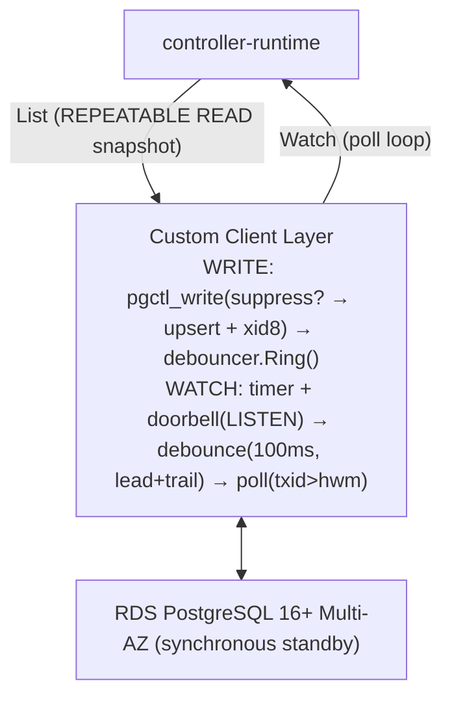

# High-Performance Postgres-Backed Control Plane — Design & Hardening Plan (v4)

**Status:** Proposed · **Platform:** AWS RDS PostgreSQL 16+ Multi-AZ (single region) · **Supersedes:** v3
**Prime directive:** correctness first. Every mechanism in this document is justified by a named invariant, every invariant has a named attack (race/failure), and every attack has a named test. Performance targets are retained but subordinate.

**Change from v3:** v4 replaces the per-(GVK, bucket) counter-based ordering with PostgreSQL's native `xid8` transaction IDs and a `pg_snapshot_xmin()` watermark. Writers no longer contend on a shared counter row — each transaction stamps its row with `pg_current_xact_id()`, eliminating the exclusive row lock that was the per-bucket throughput ceiling. Bucket sharding (`BucketIDs`, `BucketAssigner`, `UnshardedGVKs`) is removed; the `gvk_bucket_counters` table is dropped. Poll-primary watch, doorbell as latency-only optimization, and tombstone compaction are carried forward. v4 also adds: a formal invariant catalog (§2), a spec/status split (§3.3b), a race-condition catalog with deterministic tests (§5), a continuous production invariant verifier (§6), and an expanded certification plan (§7). Sizing defaults to the 5,000-cluster tier with an in-place scale-up path to 50,000 (§4).

---

## 1. Problem Statement

etcd imposes an ~8 GB practical ceiling and a single raft group; for a regional fleet control plane at 5,000+ managed clusters it is an operational bottleneck. Moving storage to PostgreSQL creates three synchronization hazards for controller-runtime's List/Watch engine:

1. **Out-of-order commits.** With naive sequences, a transaction can take sequence N but commit after N+1; a watcher tracking sequences advances past N and misses it forever.
2. **In-flight transactions.** A watcher that advances its watermark to max-seen-txid may skip a transaction that was assigned a lower txid but has not yet committed. The watermark must only advance to a point where all prior transactions are guaranteed committed.
3. **Failover regression.** A commit-ordered numbering is only trustworthy if failover can never lose an acknowledged commit; otherwise the promoted node re-issues consumed numbers — same ID, different payload — silently corrupting every downstream cache.

The system must deliver commit-ordered event streams per GVK; survive unplanned failover with zero committed-write loss; and never make event delivery depend on a push mechanism.

## 2. Correctness Invariants

These are the properties the system promises. Everything else exists to uphold them.

- **I1 — Commit-ordered delivery.** Within a GVK, the watcher watermark (`pg_snapshot_xmin()`) guarantees that every transaction with `txid < xmin` has committed. Rows with `txid_stamp` above the watermark may be re-delivered on subsequent polls until they fall below a future `xmin`; the informer cache deduplicates them. Aborted transactions never produce a visible `txid_stamp`.
- **I2 — No regression.** `pg_snapshot_xmin()` for any GVK never decreases — across crashes, failovers, and promotions. This relies on RDS Multi-AZ synchronous replication: the standby has every committed write before it takes over, so transaction IDs never rewind. On database restore from backup, all controller pods must be restarted so caches relist from the current state.
- **I3 — Exactly-once delivery per state.** A watcher starting from watermark W receives every object state-change with `txid_stamp > W` at least once (re-delivery of in-flight txids is expected and deduplicated), with no losses, regardless of doorbell behavior. Coalescing rapid updates to the latest state per object is permitted — Kubernetes watch semantics.
- **I4 — RV monotonicity.** The watermark resourceVersion observed by any client never moves backwards. Under RDS Multi-AZ synchronous replication, failover preserves all committed transactions. On database restore, restarting controller pods forces a relist from the current state.
- **I5 — Compaction safety.** A watcher can never silently skip a compacted event: if its watermark predates the `compacted_xid` for any GVK, it receives `410 Gone` and relists; otherwise its stream is complete.
- **I6 — Optimistic concurrency.** An update presenting a stale `object_version` is rejected (409); no lost updates on a single object.
- **I7 — Partition completeness.** When sharding is enabled, the union of all replicas' owned residues for a given `Mod` must cover `[0, Mod)`. Every namespace hashes to exactly one residue, so every namespace is watched by at least one replica. During scale-up (changing `Mod`), a transient period exists where some namespaces are watched by both old and new replicas — this is benign (duplicate reconciles, deduplicated by the informer cache).

**Not provided:** Owner-reference garbage collection is intentionally left to controllers. In Kubernetes, the API server's GC cascade-deletes dependents when their owner is removed; here, controllers handle this via standard controller-runtime patterns (`Owns()` watches + finalizer-driven cleanup). This keeps the storage layer simple — no cross-object graph traversal.

## 3. Architectural Design



### 3.1 Schema

```sql
-- 1. Resources: one row per object. Three lifecycle states:
--    live (deletion_timestamp IS NULL),
--    dying (deletion_timestamp set, has finalizers — still visible to controllers),
--    fully deleted / tombstone (deletion_timestamp set, no finalizers — compactable).
CREATE TABLE kubernetes_resources (
    gvk                TEXT        NOT NULL,
    namespace          TEXT        NOT NULL,
    name               TEXT        NOT NULL,
    uid                UUID        NOT NULL DEFAULT gen_random_uuid(),
    txid_stamp         xid8        NOT NULL,   -- pg_current_xact_id() at write time
    object_version     BIGINT      NOT NULL DEFAULT 1,
    spec               JSONB       NOT NULL,
    status             JSONB       NOT NULL,
    metadata           JSONB       NOT NULL,
    deletion_timestamp TIMESTAMPTZ NULL,
    created_at         TIMESTAMPTZ DEFAULT now(),
    updated_at         TIMESTAMPTZ DEFAULT now(),
    PRIMARY KEY (gvk, namespace, name)
);

CREATE INDEX idx_resources_list
    ON kubernetes_resources (gvk)
    WHERE deletion_timestamp IS NULL;
CREATE INDEX idx_resources_watch
    ON kubernetes_resources (gvk, txid_stamp);

-- 2. Compaction horizon per GVK
CREATE TABLE compaction_horizon (
    gvk           TEXT   NOT NULL PRIMARY KEY,
    compacted_xid BIGINT NOT NULL
);

```

### 3.2 Composite resourceVersion

`12345678` — a single `xmin - 1` watermark (decimal). Everything at or below this watermark is committed and delivered. Sub-horizon watermark → `410 Gone` (**I5**).

When stamped on a single object delivered by a watch event, the object's own version rides along as an `o<version>;` prefix: `o5;12345678`. Write paths parse the prefix to keep optimistic concurrency working for objects taken from the informer cache; watch resumption ignores it.

### 3.3 Atomic Write Path — Stored Procedure

The write path uses a server-side stored procedure `pgctl_write()` that performs no-op suppression and upsert in a single server-side call, run in **autocommit mode** (no explicit `BEGIN`/`COMMIT`). Each row is stamped with `pg_current_xact_id()` — PostgreSQL's native transaction ID — so writers never contend on a shared counter. The doorbell is handled by a **debouncer** that coalesces notifications per GVK into a single `pg_notify` every 50ms (see §3.5).

```sql
-- Single autocommit call — no BEGIN/COMMIT wrapper needed.
SELECT * FROM pgctl_write(
    $status_only,       -- TRUE for WriteStatus path
    $gvk, $ns, $name,
    $expected_version,
    $force_write,       -- TRUE bypasses no-op suppression
    $spec, $status, $metadata, $deletion_ts
);
-- Returns: (uid, object_version, txid, changed, suppress_us, upsert_us)
-- changed=FALSE means no-op suppression fired — no upsert.
-- txid is from pg_current_xact_id().

-- Doorbell: if changed=TRUE, the writer calls debouncer.Ring(gvk).
-- The debouncer batches and sends pg_notify at most once per window per GVK.
```

Inside `pgctl_write()`, the steps are:

**Tombstone revival:** A create that hits `unique_violation` may be blocked by a tombstone awaiting compaction. The write path attempts to revive it: `UPDATE ... SET uid = gen_random_uuid(), object_version = 1, deletion_timestamp = NULL ... WHERE deletion_timestamp IS NOT NULL AND (no finalizers)`. A fresh UID ensures watchers and owner references treat this as a new object. If the blocking row is live or dying (has finalizers), the UPDATE matches zero rows and the write returns `AlreadyExists`.

**(a) SUPPRESSION CHECK** — upholds I3. PK-read the existing row; if content is identical (see §3.3c), return `(uid, version, 0, false)` immediately — no upsert.

**(b) UPSERT** — upholds I1/I6. The upsert stamps the row with `pg_current_xact_id()` and checks `object_version = $expected_version`; zero rows ⇒ `RAISE EXCEPTION` with `P0002` (409 Conflict).

Client rules: errors raised inside `pgctl_write()` abort the implicit transaction automatically (no partial state). Any ambiguous commit outcome (connection dropped mid-COMMIT) is resolved by reading back the row using the returned `txid` before retrying — the write is idempotent to verify because `object_version` and `txid_stamp` identify it.

**Why autocommit:** the stored procedure is a self-contained atomic operation. Running it in autocommit mode eliminates 2 round-trips per write (no `BEGIN`/`COMMIT`). On Aurora with cross-AZ latency (~0.5–1ms per hop), this cuts ~2–3ms of pure network overhead per write. Side benefit: shorter xmin pin, since the implicit transaction releases immediately after the server commits.

**Why a stored procedure:** collapsing suppression check and upsert into one server-side call eliminates network round-trips. Combined with the debounced doorbell (which eliminates the per-write `pg_notify` that was catastrophic on Aurora — each notification added a full round-trip to the distributed storage layer), this achieves near-linear throughput scaling with concurrency.

### 3.3b Status Write Path (Spec/Status Split)

In Kubernetes, spec (desired state) and status (observed state) are written by different controllers — e.g., the API server writes spec while a controller writes status. The system supports this with a `WriteStatus` path that uses the **same `pgctl_write()` stored procedure** (§3.3). The differences are:

1. **UPDATE only touches `status`** — `spec`, `metadata`, and `deletion_timestamp` are unchanged. There is no create path; the object must already exist (`ExpectedVersion > 0`).
2. **Same `object_version` and `txid_stamp`.** Both `Write()` and `WriteStatus()` bump the same `object_version` column and stamp the same `txid_stamp` on `kubernetes_resources`. This ensures watchers see a single event stream covering both spec and status changes.
3. **No-op suppression compares only `status`** (not all four content fields). See §3.3c.

The call pattern is identical to §3.3 — `pgctl_write(...)` in autocommit mode, debouncer ring after if `changed=TRUE`.

**Symmetric `WriteObject` path:** `WriteObject` mirrors `WriteStatus` — it updates only `spec`, `metadata`, and `deletion_timestamp`, leaving `status` untouched. This is the write path used by controller-runtime's `client.Update()` (via pgruntime), matching the Kubernetes API server's behavior where `Update` writes spec + metadata only. `WriteObject` passes `null` for the status parameter; the stored procedure uses `COALESCE(p_status, status)` to preserve the existing status column. Like `WriteStatus`, `ExpectedVersion` must be > 0 (no create path).

### 3.3c No-Op Write Suppression

Content-equal writes consume no sequence number, emit no doorbell, and bump no `object_version`. This matches Kubernetes API-server semantics where an update that changes nothing does not advance resourceVersion. The feature is default-on; callers set `ForceWrite: true` to bypass it.

**Mechanism:** inside `pgctl_write()`, before the counter increment, the stored procedure reads the existing row by primary key. If the row exists and all compared fields are equal to the incoming values, the procedure returns `(uid, version, 0, false)` immediately — no counter increment, no upsert. The caller sees `changed=FALSE` and skips the doorbell.

**Field comparison rules (inside `pgctl_write()`):**

- `Write()` compares all four content fields: `spec`, `status`, `metadata`, `deletion_timestamp`. JSONB equality (`=`) is key-order-insensitive; timestamp comparison uses `time.Equal()` to handle timezone normalization.
- `WriteObject()` (null status parameter) compares `spec`, `metadata`, and `deletion_timestamp` (not `status`). The stored procedure handles null status via `(p_status IS NULL OR v_existing.status = p_status)` in the suppression check.
- `WriteStatus()` compares only `status`.

**Create-path behavior (ExpectedVersion == 0):** if the row already exists and content matches, the write is treated as a replayed create — returns `Changed: false` with the existing row's version and UID. If content differs, returns `ErrAlreadyExists` as before.

**`WriteResult.Changed`** indicates whether the write produced a new state. Callers can use this to skip downstream side-effects on no-ops.

**Invariants preserved:**

- **I1 (commit ordering):** suppressed writes don't stamp a new txid — no ordering concern.
- **I3 (exactly-once delivery):** no event emitted for no state change — correct Kubernetes semantics.
- **I6 (optimistic concurrency):** content-equal ⇒ intent satisfied regardless of version.

**Performance:** one PK read per write inside the stored procedure. Under load tests with unique content per write (suppression finds "no match" and proceeds normally), no measurable regression.

### 3.4 List

Single `REPEATABLE READ` transaction: get `pg_snapshot_xmin(pg_current_snapshot())` (the watermark), then scan live and dying resource rows. Fully-deleted tombstones (deletion_timestamp set, no finalizers) are excluded by the query: `AND (deletion_timestamp IS NULL OR metadata->'finalizers' != '[]'::jsonb)`. Dying objects (deletion_timestamp set, has finalizers) are included so controllers can perform cleanup — matching the Kubernetes API server's finalizer contract. The watermark and the row scan share the same snapshot — no skew window (supports I3/I4 handoff into Watch). ResourceVersion is set to `xmin - 1`.

### 3.4b Read Model: Direct Reads vs. Cached Reads

`Client.Get()` reads directly from PostgreSQL on every call — no in-memory cache. This differs from standard controller-runtime, where `Get()` inside a `Reconcile` reads from an informer cache populated by the List/Watch stream.

**Why direct reads are the default:** Controllers with low read rates (a handful of objects per reconcile cycle, not thousands) benefit from simpler code that always returns committed state, avoiding a class of staleness bugs. The `ListerWatcher` already feeds the watch stream for event-driven reconciliation; `Get()` is a point-read for the current object, not a scan.

**When to consider a cached model:** If reconcilers perform many `Get()` calls per cycle, or if multiple informers share the same `ListerWatcher`, wiring it into controller-runtime's standard cache reduces DB load and read latency. The `ListerWatcher` already implements the List/Watch contract, so the integration is mechanical — the hard part (commit-ordered, exactly-once event stream) is already done.

**Trade-offs:**

|              | Direct reads (current)                | Cached reads                                                  |
| ------------ | ------------------------------------- | ------------------------------------------------------------- |
| Read latency | ~1–5ms (Postgres round-trip)          | ~0ms (memory)                                                 |
| Freshness    | Always committed state                | Up to one poll interval stale (5s worst case, ~100ms typical) |
| DB load      | One query per `Get()`                 | Zero read queries from reconcilers                            |
| Memory       | None beyond the connection            | Full working set in memory per controller                     |
| Complexity   | Simpler — no cache coherence concerns | Requires trusting the watch stream entirely                   |

For conflict resolution and ambiguous-commit read-back, the direct `Get()` (or `ReadBack`) is always needed regardless of the read model — those paths require the live database value.

### 3.5 Watch — Single-Goroutine Poll-Primary with Doorbell

Polling is the correctness mechanism (**I3**); the doorbell only changes _when_ a poll happens.

**Poll cycle** per GVK: a single **REPEATABLE READ read-only transaction** per poll cycle covers the compaction horizon check and all row queries within one snapshot. This snapshot isolation means mid-poll compaction is invisible (B3 defense). The poll reads `pg_snapshot_xmin(pg_current_snapshot())` to get `xmin`, checks the compaction horizon, then runs `SELECT ... WHERE gvk=$1 AND txid_stamp::text::bigint > $hwm ORDER BY txid_stamp` (served by `idx_resources_watch`). Dispatch Added/Modified/Deleted; advance the watermark to `xmin - 1` (not to max-seen-txid — this ensures everything below the new watermark is committed). Rows between the old watermark and `xmin - 1` may re-appear on subsequent polls; this is expected and deduplicated by the informer cache. The client layer (e.g., pgruntime) further classifies Deleted events based on finalizer state: objects with active finalizers dispatch OnUpdate (the object is dying but still visible to controllers), while objects with no finalizers dispatch OnDelete (the object is fully gone). Rapid updates to one object coalesce naturally, which is correct Kubernetes watch semantics (I3).

**Single-goroutine scheduler** — one loop owns all polling, one timer, and local state (`lastPoll`, `doorbellPending`). The listen goroutine only forwards notifications into a 1-buffered channel; it uses a child context that is cancelled when the main loop exits, ensuring prompt shutdown on poll errors. The watermark is never accessed concurrently (R13 defense).

**Scheduling** — three triggers, one timer:

1. **Baseline timer: 5 s** unconditional (liveness backstop; sole guarantee under doorbell loss).
2. **Doorbell:** `LISTEN <channel>` where the channel is per-GVK (`resource_changes_<gvk>` for short GVKs, `rc_<sha256[:12]>` for long ones that exceed PostgreSQL's 63-byte identifier limit). Any notification requests an early poll.
3. **Debounce floor 100 ms, leading + trailing edge.** If `time.Since(lastPoll) >= DebounceFloor` → leading edge, poll immediately. Otherwise → trailing edge: set `doorbellPending`, reset timer to `lastPoll + DebounceFloor`. Every poll error terminates `Run` uniformly — no error is silently swallowed.

**Doorbell debouncer:** writers do not call `pg_notify` directly. Instead, each write calls `debouncer.Ring(gvk)`, which marks the GVK as dirty. A background goroutine wakes every 50ms and issues one `pg_notify` per dirty GVK, then clears the dirty set. This coalesces bursts of writes into at most one notification per 50ms per GVK — critical on Aurora where per-write `pg_notify` added a full round-trip to the distributed storage layer, capping throughput at ~538 w/s.

**Doorbell loss:** on any LISTEN drop (including failover) reconnect, re-LISTEN; the next baseline poll reconciles. No catch-up/stream ordering hazard exists — there is only the poll.

### 3.6 Tombstone Compaction

A **single CTE** atomically deletes fully-deleted tombstones (deletion_timestamp set, no active finalizers) and advances the compaction horizon — the horizon must never lag the physical delete, or a watcher could see an unexplained gap (I5):

```sql
WITH del AS (
    DELETE FROM kubernetes_resources
    WHERE deletion_timestamp IS NOT NULL
      AND GREATEST(deletion_timestamp, updated_at) < now() - $retention
      AND (metadata->'finalizers' IS NULL OR metadata->'finalizers' = '[]'::jsonb)
    RETURNING gvk, txid_stamp
),
horizon AS (
    INSERT INTO compaction_horizon (gvk, compacted_xid)
    SELECT gvk, max(txid_stamp::text::bigint) FROM del GROUP BY gvk
    ON CONFLICT (gvk)
    DO UPDATE SET compacted_xid = GREATEST(
        compaction_horizon.compacted_xid,
        EXCLUDED.compacted_xid
    )
)
SELECT count(*) FROM del;
```

The finalizer guard (`metadata->'finalizers' IS NULL OR metadata->'finalizers' = '[]'::jsonb`) ensures that dying objects — those with `deletion_timestamp` set but still carrying active finalizers — survive past the retention window. Controllers need these objects visible to complete cleanup before removing their finalizers; only after all finalizers are removed does the object become a fully-deleted tombstone eligible for compaction.

Default retention: 24 h. Retention must exceed the slowest legitimate watcher resume interval; enforce with an alarm on watcher hwm age approaching retention/2. The `GREATEST` in the upsert ensures the horizon never moves backwards even under concurrent compaction runs.

### 3.7 Failover

- **Unplanned:** Multi-AZ promotes the sync standby (~60–120 s). No acknowledged commit lost ⇒ I1–I2 hold by construction. All connections drop; writers run tripwires; watchers reconnect and the next baseline poll reconciles.
- **Planned:** orchestrated in a window (quiesce, verify lag 0, fail over, resume) so the reconnect surge is scheduled.
- Async read replicas are never unplanned-promotion candidates.
- **Restore from backup:** because a restore can legitimately rewind state, all controller pods must be restarted after a restore so caches relist from the current state. This is an operational runbook item — the restart also happens naturally since DB connections break during a restore.

## 4. Infrastructure & Sizing

| Item            | 5,000-cluster tier (default)                    | 50,000-cluster path                     |
| --------------- | ----------------------------------------------- | --------------------------------------- |
| Instance        | `db.r6g.large` or `xlarge` (Multi-AZ)           | resize in place to `db.r6g.2xlarge`     |
| Data            | ~2.6 GB (RAM-resident many times over)          | ~26 GB (still RAM-resident)             |
| Load            | ~187 RPS steady / ~374 burst                    | 1,870 / 3,740 RPS                       |
| Engine          | PostgreSQL 16/17 (avoid Extended Support cliff) | same                                    |
| Storage         | gp3, IOPS = write path + WAL, ×3 headroom       | raise IOPS                              |
| Doorbell extras | single debounce window sufficient               | tune debounce window under Phase 5 load |

Correctness controls are identical at both tiers — races don't scale down.

## 5. Race & Failure Catalog — each with a deterministic test

Every entry names the invariant at stake, the interleaving, the defense, and the test that forces the interleaving (not hopes for it). Go tests use the race detector plus explicit synchronization points (test hooks that pause a goroutine at specific write-path steps, etc.); DB-level interleavings are forced with two sessions and explicit `pg_sleep`/lock ordering, or with a proxy (e.g. Toxiproxy) injecting drops at exact protocol moments.

- **R2 — Debounce swallow (latency only, but test anyway).** Doorbell arrives during a poll cycle. _Defense:_ single-goroutine scheduler with leading/trailing debounce (§3.5) — a doorbell during a poll sets `doorbellPending`, guaranteeing a trailing poll after DebounceFloor. _Test:_ inject a doorbell during the poll snapshot window; assert a trailing poll follows within DebounceFloor. Run under `-race`.
- **R3 — Doorbell loss (I3).** LISTEN connection drops silently; notifications lost. _Defense:_ poll-primary. _Test:_ proxy kills the LISTEN socket mid-burst without client error; assert every event still delivered within baseline interval, zero dups.
- **R4 — Concurrent first-write race (I1).** Two txns race to INSERT the same resource. _Defense:_ unique PK constraint; the loser retries or gets `AlreadyExists`. _Test:_ two sessions insert concurrently; both get valid `txid_stamp` values, watchers see both events.
- **R5 — Ambiguous commit (I1/I3).** Connection drops during COMMIT; client doesn't know if the write landed. _Defense:_ read-back protocol using the returned `txid` (§3.3). _Test:_ proxy drops the connection after COMMIT is sent but before the OK; assert the client's read-back + retry yields exactly one committed state change.
- **R7 — Compaction vs. slow watcher (I5).** Watcher resumes with hwm just below a freshly advanced horizon. _Defense:_ horizon advanced transactionally with the delete; boundary check on poll. _Test:_ freeze a watcher, compact past its hwm, resume; assert `410 Gone` (never a silent gap). Also the off-by-one: hwm == horizon exactly must succeed.
- **R8 — Failover mid-transaction (I1–I2).** Failover strikes between counter increment and COMMIT. _Defense:_ the whole txn aborts atomically; sync standby has all acknowledged commits. _Test:_ Phase 6 drill with writes in flight; assert aborted increment rolls back cleanly and no regression.
- **R10 — 409 handling corrupting the stream (I1).** Buggy client retries the upsert inside the same txn after a version conflict. _Defense:_ autocommit mode makes it structurally impossible (no open transaction to retry within); the stored procedure raises an exception that aborts the implicit transaction.
- **R12 — Concurrent spec/status writes (I1).** Writer A writes spec, writer B writes status to the same resource. Each gets a distinct `txid_stamp`; the watcher must see both state changes. _Defense:_ `pg_current_xact_id()` is unique per transaction; `object_version` serializes updates via optimistic concurrency. _Test:_ interleaved spec and status writes each get distinct txids; watcher starting from hwm sees correct state.
- **R13 — Single-goroutine poll serialization (I3).** Rapid doorbell bursts overlapping with the baseline timer must not produce concurrent poll cycles — the watermark is not safe for concurrent access and concurrent polls could deliver events out of order. _Defense:_ single-goroutine scheduler (§3.5) — only one goroutine reads the watermark, the listen goroutine only forwards into a buffered channel. _Test:_ fire 10 rapid doorbells while baseline timer is due; assert exactly one poll executes at a time and events arrive in txid order.
- **R15 — Mid-poll compaction (I5).** Compaction runs and advances the horizon while a watcher is mid-poll. The watcher must not see an inconsistent state (some rows deleted, horizon advanced, within a single poll cycle). _Defense:_ REPEATABLE READ snapshot isolation — the poll transaction sees the database as of its snapshot instant; the compaction's DELETE and horizon UPDATE are invisible within the poll cycle. _Test:_ start a watcher poll (paused via hook), run compaction in a separate session, resume the poll; assert the watcher sees all pre-compaction rows and no unexplained gaps.
- **RB4 — No-op write suppression (I1/I3).** Content-equal writes must be suppressed without violating any invariant. Six sub-cases:
  - **RB4a** — Identical write suppressed: no txid_stamp consumed, no version bump.
  - **RB4b** — Real change after no-op correctly stamped (gets a txid, watcher sees exactly one event).
  - **RB4c** — Watcher sees no event for suppressed write (I3).
  - **RB4d** — Replayed create with identical content suppressed.
  - **RB4e** — WriteStatus suppression (only status field compared).
  - **RB4f** — ForceWrite bypasses suppression.

## 6. Continuous Invariant Verification (production, not just tests)

Correctness that is only tested pre-GA decays. Run a **verifier** as a permanent, low-priority consumer in every environment:

- Subscribes (via the ordinary poll path) to each watched GVK and checks:
  - **I2 — monotonic watermarks:** the watermark never decreases. Any regression is an invariant violation.
  - **I5 — compaction consistency:** if the verifier's watermark falls below `compacted_xid`, it must receive `410 Gone` — silence would itself be the violation.
- **Re-delivery tracking.** In the xid8 watermark model, rows between the old watermark and `xmin - 1` may be re-delivered on each poll. Re-deliveries are counted (expected behavior), not flagged as violations.
- A canary probe writes a synthetic object at low rate and measures write→delivery latency (doorbell health) via a **bounded ring buffer** (1,000 samples) with p99 tracking.
- Any violation should page. Under RDS Multi-AZ synchronous replication, a sequence regression should be impossible — if the verifier fires, something is deeply wrong.
- The verifier is also the acceptance oracle for every phase in §7 — the same code judges tests and production.

## 7. Certification Test Plan

- **Phase 0 — Race catalog (new, gating).** All §5 tests green under `-race`, 1,000× repetition for the timing-sensitive ones, before any load phase runs. These are unit/two-session tests — cheap, deterministic, first.
- **Phase 1 — Write ceiling.** Sweep across worker counts (1–64) per GVK, target instance with sync standby in the commit path. Record maximum writes/s as the capacity budget.
- **Phase 2 — Steady state.** Tier load (187 RPS at 5k; 1,870 at 50k cert) for 48 h, verifier attached. CPU <60%, read IOPS ≈0, p50 write <15 ms, verifier silent.
- **Phase 2b — Hot-GVK skew.** Zipfian: hottest GVK gets 80% of writes while the rest are cold. Phase 2 criteria + cold-GVK p99 <15 ms (no starvation).
- **Phase 3 — Avalanche & crash recovery.** Kill half the writers under load. New writers start and race on the same resources, relying on optimistic concurrency (409 Conflict) to resolve contention. No CPU exhaustion or dropped connections; verifier reports zero violations; zero stale writes.
- **Phase 4 — 7-day soak.** Autovacuum sawtooth on dead tuples; table+index ≤1.5× live set; counter HOT ratio ≥90%; `idx_resources_watch` bloat contained; compactor bounded; sub-horizon RVs get `410`.
- **Phase 5 — Poll & doorbell.** At tier burst with 10/50/200 watchers: baseline poll adds <5% CPU; healthy-doorbell delivery p99 <150 ms; **notify-loss drill:** disable pg_notify mid-run — delivery continues within baseline interval, verifier silent.
- **Phase 6 — Failover drills.** Unplanned (reboot-with-failover) under load + one orchestrated planned failover, repeated ≥5×. RTO ≤120 s; zero acknowledged-write loss; tripwires silent; verifier confirms commit-ordered continuity through every drill. Include R8 assertions.
- **Phase 7 — Backup/restore regression.** Restore a snapshot into a fresh instance (DR path). Because a restore _can_ legitimately rewind state, all controller pods must be restarted after the restore so caches relist from the current state. The drill asserts that after restart, controllers converge to the correct state with no stale data.

## 8. Namespace-Hash Sharding

Read-side controller sharding partitions the cache's List/Watch streams across replicas by namespace hash. Each replica watches only the namespaces whose hash residue it owns, reducing per-replica memory and poll load proportionally to the shard count.

### 8.1 Approach

Sharding uses PostgreSQL's built-in `hashtext()` function applied to the namespace column:

```sql
abs(hashtext(namespace)::bigint) % $Mod = ANY($Owned::int[])
```

The cast to `bigint` before `abs()` avoids overflow when `hashtext()` returns `INT_MIN` (`-2147483648`), since `abs(-2147483648::int)` exceeds the int4 range. The predicate is appended to both List and Watch queries as an additional `WHERE` clause. Shard membership is immutable per object — namespace is part of the primary key and is never updated in place.

### 8.2 Types

Two types expose sharding at different layers:

- **`reader.ShardSpec`** (internal) — `Mod int`, `Owned []int`. Generates the SQL clause and validates that `Mod > 0`, `Owned` is non-empty, each residue is in `[0, Mod)`, and there are no duplicates.
- **`pgruntime.ShardConfig`** (public API) — mirrors `ShardSpec` and adds `UnshardedGVKs []schema.GroupVersionKind` for GVKs that every replica must watch fully (e.g., cluster-scoped configuration resources like `ManagementCluster`).

### 8.3 Scope

- **Sharded:** the cache's informer-backed List/Watch (the `ListerWatcher` created inside `pgCache.getOrCreateInformer`). Each informer's poll query includes the shard predicate, so the informer cache contains only the replica's owned namespaces.
- **Never sharded:** the direct client (`GetClient()`, `GetAPIReader()`). Point reads (`Get`) and direct `List` calls always query the full dataset — they bypass the informer cache entirely. This ensures cross-shard reads remain possible when needed (e.g., looking up a resource in a namespace owned by another shard).
- **`UnshardedGVKs`:** GVKs listed here skip the shard predicate entirely. Every replica watches the full set of objects for these GVKs.

### 8.4 Invariants

- **I7 — Partition completeness.** The union of all replicas' `Owned` residues must cover `[0, Mod)`. This is an operational invariant — the system validates each replica's config independently but cannot enforce fleet-wide completeness.
- **No schema changes.** Sharding is purely a query-side filter. No new tables, columns, indexes, or migrations are required.
- **No write-path changes.** Writers are unaffected. All writes go through the same `pgctl_write()` stored procedure regardless of sharding.
- **`Shard == nil` preserves pre-change behavior byte-for-byte.** When no `ShardConfig` is provided, no shard predicate is appended and the system behaves exactly as before.

### 8.5 Scaling

To change the number of shards, update `Mod` and the `Owned` residues in each replica's configuration, then perform a rolling restart. During the transition, some namespaces may be watched by both old-config and new-config replicas. This is benign — duplicate reconciles are deduplicated by the informer cache, and the write path is unaffected. Once all replicas are running the new config, each namespace is watched by exactly one replica (assuming partition completeness).

### 8.6 PostgreSQL version caveat

`hashtext()` output values may change across PostgreSQL major versions. A major-version upgrade causes a fleet-wide reshuffle of namespace-to-shard assignments. This is benign — all replicas restart during a major upgrade anyway, and the transient period of duplicate watches resolves once the rolling restart completes.

## 9. Open Items

- Baseline poll interval (5 s launch) vs. Phase 5 idle-load data.
- Compaction retention (24 h) vs. slowest informer restart — confirm with ops; alarm at retention/2.
- Debouncer window (50 ms) vs. delivery latency requirements — tune under Phase 5 load.
