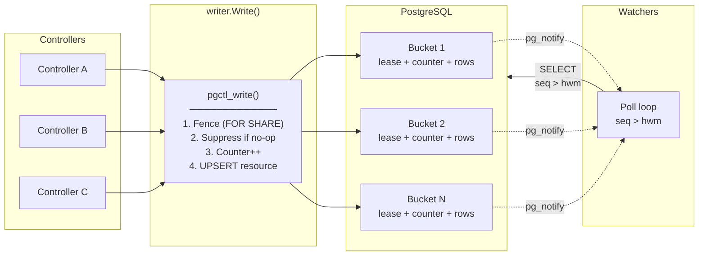

# postgres-controller-backend

Kubernetes-style List/Watch storage for controllers on plain PostgreSQL — no etcd, no consensus, one commodity managed database.

`etcd` — the standard backing store for Kubernetes controllers — can become a bottleneck at scale, and colocating application state in the cluster's own etcd complicates the DR story. This system delivers comparable write throughput (~10k w/s) on a single modest Postgres instance (db.m6g.2xlarge, ~$500/mo), with fewer moving parts, an independent backup/restore lifecycle, and no write-race conditions by design.

**This is not a general-purpose etcd replacement.** It targets deployments where you own every writer and each object has a single spec owner and a single status owner. Check [Is this for you?](#is-this-for-you) to see if your use case matches the assumptions. If not, use [kine](https://github.com/k3s-io/kine).

## The mental model

Five ideas carry the whole design:

- **Buckets.** Resources are partitioned client-side: a caller-supplied function maps each object (namespace, name) to one of N buckets. The database stores whatever bucket ID it's given and never re-shards. The bucket is the unit of write concurrency, lease assignment, and event ordering.
- **Leases instead of raft.** At most one writer per bucket per sub-resource (spec/status), enforced by lease-based fencing: every write takes a `FOR SHARE` row lock on its lease row, so a stale writer is physically blocked from committing — even one that believes it still holds the lease. This replaces consensus with row locks.
- **Gapless sequences.** Each (GVK, bucket) pair has its own counter, created on first use — no global sequence bottleneck. Within a bucket, committed sequence numbers are exactly 1, 2, 3, … and sequence order equals commit order, so watchers get a gap-free, commit-ordered event stream.
- **Poll-primary watch.** Watchers *pull* events from the table; the LISTEN/NOTIFY doorbell is a latency-only optimization. Total notification loss costs latency (bounded by the baseline poll, 5s default), never events.
- **Timeline epochs.** The resourceVersion is a timeline epoch plus a per-bucket high-water-mark vector. Failover bumps the epoch; watchers with stale positions get `410 Gone` and relist instead of silently missing events.

[WALKTHROUGH.md](WALKTHROUGH.md) develops each of these in narrative form; [DESIGN.md](DESIGN.md) is the full specification.

## Is this for you?

Only use if you can satisfy all three assumptions:

1. **You own every writer, and every writer uses this library with the same configuration.** Writers can be controller-runtime reconcilers, an API server fronting the database, a stream bridge — anything, as long as all writes go through this library and every writer shares one configuration (bucket topology and the object→bucket assigner are part of that configuration; how buckets uphold the guarantees is an implementation detail, explained in [DESIGN.md](DESIGN.md)). Nothing server-side validates a writer's configuration, so the guarantees hold only because every writer is yours. The configuration is fixed for the life of a deployment (changing it requires all watchers to relist).

2. **Each object's spec has exactly one owner at any time, and likewise its status.** The same component may own both (the common case) or they may be split — e.g., an API server writes spec while a controller writes status. In practical terms: **no two controllers may update the same object's spec, and no two may update the same object's status**. Patterns where multiple actors patch the same sub-resource — as arbitrary clients can against a Kubernetes API server — are out of scope. Ownership is granted by leases at partition granularity, coarser than per-object, so writers must accept partition-level assignment.

3. **Single-primary PostgreSQL 16+.** No multi-region, no multi-writer — the correctness mechanisms are row locks in one primary. Synchronous replication to a standby is required for the claim that failover never loses an acknowledged commit. AWS RDS Multi-AZ is the reference deployment (and where the performance numbers come from), not a requirement.

Otherwise, use `etcd` or `kine`, for example.

## Getting started

The [`examples/`](examples/) directory contains the same controller implemented twice — once with controller-runtime against etcd, once with [`pkg/crbridge`](pkg/crbridge/) against PostgreSQL — showing exactly what changes when migrating. The postgres wiring looks like:

```go
conn, _ := pgx.Connect(ctx, dsn)
schema.Migrate(ctx, conn)                                // idempotent

leaseMgr := lease.NewBothManager(leaseConn, holderID)
epochs, _ := leaseMgr.AcquireBoth(ctx, bucketID, leaseTTL)

greetingClient := crbridge.NewTypedClient[GreetingSpec, GreetingStatus](
    crbridge.NewClient(connFactory, gvk, assigner, holderID, epochs.Spec),
    crbridge.NewListerWatcher(connFactory, gvk, buckets),
)

mgr := crbridge.NewManager(crbridge.ManagerConfig{...})
crbridge.NewControllerFor[GreetingSpec, GreetingStatus](mgr, gvk, reconciler).
    Watches(gvkGreetingPolicy, reconciler.policyToGreetings).
    Complete()
mgr.Start(ctx)
```

See [`examples/README.md`](examples/README.md) for the full migration guide, a line-count breakdown, and a step-by-step checklist.

## Architecture

PostgreSQL 16 is the authoritative store, with:

- **Server-side stored procedure (`pgctl_write()`)** — fence check, no-op suppression, counter increment, and upsert in a single server-side call, with the `pg_notify` doorbell fired after commit to avoid the global notification-queue lock
- **Per-(GVK, bucket) gapless sequence counters** for commit-ordered event streams, each created on first use
- **Independent spec/status fencing** — one `bucket_leases` table with a `domain` column (`'spec'`/`'status'`); each row is fenced independently, so both write paths (`Write`, `WriteStatus`) share the same sequence and `object_version` while holding separate leases
- **No-op write suppression** — content-equal writes consume no sequence number, emit no doorbell, and bump no `object_version`, matching API-server semantics where a no-change update does not advance resourceVersion. Default on; `ForceWrite` opts out; `WriteResult.Changed` lets callers skip downstream side-effects
- **Single-goroutine poll-primary watch** — all polling in one goroutine with snapshot-isolated (`REPEATABLE READ`) poll cycles, LISTEN/NOTIFY doorbell with automatic reconnection (`ListenConnFactory`, exponential backoff)
- **Tombstone compaction** via a single CTE (atomic delete + horizon advancement)
- **Timeline epochs** for failover detection
- **Prometheus instrumentation** across writer, watcher, verifier, and lease paths ([METRICS.md](METRICS.md))



## Correctness

Every mechanism is justified by one of 8 named invariants (I1–I8, DESIGN.md §2) — gapless issuance, commit order = sequence order, no regression across failover, single writer, exactly-once watch delivery, resourceVersion monotonicity, compaction safety, optimistic concurrency.

Every invariant has a corresponding race or failure scenario and a **deterministic test that forces the interleaving** — 25 tests in total (R1–R18, RB4a–g; full catalog in DESIGN.md §5):

| Theme | Tests | What they prove |
|-------|-------|-----------------|
| Lease fencing & handover | R1, R6, R11, R12 | `FOR SHARE` blocks epoch bumps while a spec or status write is in-flight; streams stay gapless across handover; concurrent spec/status writers share one ordered stream with cross-domain fencing enforced |
| Sequence integrity | R4, R5, R10 | Concurrent first writes, ambiguous commits, and 409 rollbacks never create gaps or duplicates |
| Watch delivery | R2, R3, R13, R16, R17, R18 | No event is swallowed by debouncing, doorbell loss, rapid-doorbell coalescing, multi-bucket interleaving, or cancel/resume from the high-water mark |
| Compaction & failover | R7, R9, R14, R15 | Watchers behind a compaction horizon or on a stale timeline epoch get `410 Gone` (never a silent skip); mid-poll compaction is invisible under snapshot isolation |
| No-op suppression | RB4a–g | Suppressed writes consume no sequence and emit no event; real changes after a no-op sequence correctly; suppression still holds the fence lock |

R3 and R5 additionally have Toxiproxy variants that inject network-level faults (TCP RST), including a test that verifies the doorbell fast path recovers after a connection kill.

Beyond tests, the [`internal/verifier`](internal/verifier/) package runs the same checks continuously in production (DESIGN.md §6): it subscribes via the ordinary poll path and verifies monotonic high-water marks (I3/I6) and that all gaps are explained by the compaction horizon (I7), with O(buckets) state. An optional canary writer measures write-to-delivery latency (p99 via bounded ring buffer, exported as `pgctl_verifier_canary_delivery_seconds`). The same code is the acceptance oracle for load tests.

## Performance

AWS RDS Multi-AZ (synchronous commit), stored procedure write path, one writer per bucket, 64 buckets:

| Instance | vCPU | Writes/s | p50 | p99 |
|----------|------|----------|-----|-----|
| db.m6g.large   | 2  | 2,852  | 20.0ms | 68.5ms |
| db.m6g.xlarge  | 4  | 5,770  | 10.2ms | 23.4ms |
| db.m6g.2xlarge | 8  | 9,622  | 6.1ms  | 13.2ms |
| db.m6g.8xlarge | 32 | 11,728 | 5.0ms  | 7.7ms  |

All correctness invariants (I1–I8) verified under load: zero serialization failures, zero sequence gaps, zero verifier violations across all runs.

Full perfscale suite: [`loadtest/README.md`](loadtest/README.md).

## Documentation

- [DESIGN.md](DESIGN.md) — full design: invariant catalog (I1–I8), race catalog (R1–R18), sizing, certification plan
- [WALKTHROUGH.md](WALKTHROUGH.md) — narrative explanation of why each mechanism exists and how the pieces fit together
- [ARCHITECTURE_COMPARISON.md](ARCHITECTURE_COMPARISON.md) — this direct-to-Postgres design vs. an intermediated REST-API architecture (reliability, consistency, operational surface)
- [DYNAMO_BRIDGE_DESIGN.md](DYNAMO_BRIDGE_DESIGN.md) — proposed bridge ingesting observed cluster state from per-MC DynamoDB tables into Postgres
- [METRICS.md](METRICS.md) — Prometheus metrics reference (all `pgctl_*` metrics, labels, integration guide)
- [loadtest/README.md](loadtest/README.md) — RDS perfscale suite: ceiling hunt, Phase 0–7 certification, Terraform infrastructure, scaling analysis
- [examples/README.md](examples/README.md) — etcd → postgres migration guide with side-by-side controller implementations

## Running tests

Requires: Go 1.26+, podman with a running machine (`podman machine start`).

```bash
make test-unit          # Pure unit tests (resourceversion)
make test-integration   # All DB-backed tests (schema, lease, writer, reader, compaction, verifier)
make test-race          # Race catalog R1–R18, RB4a–g under -race
make test-toxirace      # Toxiproxy-enhanced R3/R5 + doorbell reconnect
make test-load          # Phase 1 + Phase 5 load tests
make test               # Unit + integration + race
```

Stress mode for timing-sensitive race tests:

```bash
make test-race-stress   # 100x repetition under -race
```
