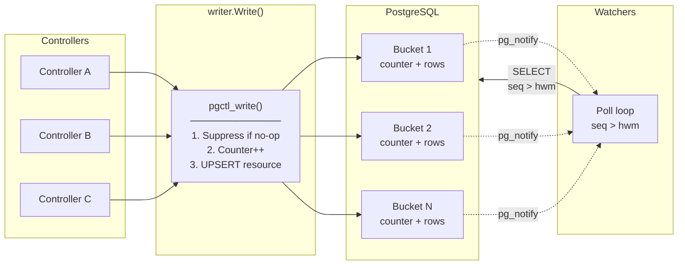

# postgres-controller-backend

Runs the controller-runtime controllers against plain PostgreSQL instead of kube-apiserver + etcd — same reconcile loops, one commodity managed database.

This works because the library re-implements the Kubernetes List/Watch contract — commit-ordered event streams with `resourceVersion` semantics — on ordinary Postgres tables. Informers, reconcile loops, and optimistic concurrency behave as they always have; underneath, writers (controllers, or an API server fronting the database) and watchers talk to Postgres directly, with no etcd protocol, no kube-apiserver, and no consensus layer in the path.

The motivation is operational. At fleet scale, etcd becomes the component you engineer around, and colocating application state in the cluster's own etcd ties your data's disaster-recovery story to the cluster's. One managed Postgres instance replaces it with a database your team already knows how to run — independent backup/restore, standard failover — and gives up nothing on throughput: ~10,000 writes/s on modest hardware (db.m6g.2xlarge), with correctness enforced by row locks.

**This is not a general-purpose etcd replacement.** It targets deployments where you own every writer and all writes go through this library. Check [Is this for you?](#is-this-for-you) to see if your use case matches the assumptions. If not, use [kine](https://github.com/k3s-io/kine).

## Is this for you?

Only use if you can satisfy both assumptions:

1. **You own every writer, and every writer uses this library with the same configuration.** Writers can be controller-runtime reconcilers, an API server fronting the database, or any other component — as long as all writes go through this library and every writer shares one configuration (bucket topology and the object→bucket assigner are part of that configuration; how buckets uphold the guarantees is an implementation detail, explained in [DESIGN.md](DESIGN.md)). Nothing server-side validates a writer's configuration, so the guarantees hold only because every writer is yours. The configuration is fixed for the life of a deployment (changing it requires all watchers to relist).

2. **Single-primary PostgreSQL 16+.** Synchronous replication to a standby is required for the claim that failover never loses an acknowledged commit. AWS RDS Multi-AZ is the reference deployment (and where the performance numbers come from), not a requirement.

Otherwise, use `etcd` or `kine`, for example.

## The mental model

Four ideas carry the whole design:

- **Buckets.** Resources are partitioned client-side: a caller-supplied function maps each object (namespace, name) to one of N buckets. The database stores whatever bucket ID it's given and never re-shards. The bucket is the unit of write concurrency and event ordering. GVKs listed in `UnshardedGVKs` bypass the assigner and use sentinel bucket `-1`, which every replica watches — useful for cluster-wide configuration resources that all pods need to see.
- **Commit-ordered sequences.** Each `(GVK, bucket)` pair has its own counter, created on first use — no global sequence bottleneck. Within a bucket, sequence order equals commit order — if seq N is visible, every seq before it is also visible — so watchers get a commit-ordered event stream.
- **Poll-primary watch.** Watchers _pull_ events from the table; the LISTEN/NOTIFY doorbell is a latency-only optimization. Total notification loss costs latency (bounded by the baseline poll, 5s default), never events.
- **Timeline epochs.** The resourceVersion is a timeline epoch plus a per-bucket high-water-mark vector. Failover bumps the epoch; watchers with stale positions get `410 Gone` and relist instead of silently missing events.

[WALKTHROUGH.md](WALKTHROUGH.md) develops each of these in narrative form; [DESIGN.md](DESIGN.md) is the full specification.

## Getting started

The [`examples/`](examples/) directory contains the same controller implemented twice — once with controller-runtime against etcd, once with [`pkg/pgruntime`](pkg/pgruntime/) against PostgreSQL — showing exactly what changes when migrating. The postgres wiring looks like:

```go
mgr, _ := pgruntime.NewManager(pgruntime.Options{
    Scheme:   scheme,
    DSN:      dsn,
    Logger:   log,
})

(&GreetingReconciler{Client: mgr.GetClient()}).SetupWithManager(mgr)
mgr.Start(ctx)
```

`pgruntime.NewManager` handles connection pooling and schema migration internally — the caller provides a DSN and a scheme, and gets back a standard `manager.Manager`. See [`examples/README.md`](examples/README.md) for the full migration guide, a line-count breakdown, and a step-by-step checklist.

## Architecture

PostgreSQL 16 is the authoritative store, with:

- **Server-side stored procedure (`pgctl_write()`)** — no-op suppression, counter increment, and upsert in a single server-side call, with the `pg_notify` doorbell fired after commit to avoid the global notification-queue lock
- **Per-(GVK, bucket) commit-ordered sequence counters** for commit-ordered event streams, each created on first use
- **No-op write suppression** — content-equal writes consume no sequence number, emit no doorbell, and bump no `object_version`, matching Kubernetes API-server semantics where an update that changes nothing does not advance resourceVersion. Default on; `ForceWrite` opts out; `WriteResult.Changed` lets callers skip downstream side-effects
- **Single-goroutine poll-primary watch** with LISTEN/NOTIFY doorbell as a latency-only optimization; all polling in one goroutine with snapshot-isolated (`REPEATABLE READ`) poll cycles; automatic LISTEN reconnection via `ListenConnFactory` with exponential backoff
- **Tombstone compaction** via a single CTE (atomic delete + horizon advancement) with finalizer guard — only fully-deleted objects (no active finalizers) are compacted; dying objects with finalizers survive past retention
- **Timeline epochs** for failover detection
- **Prometheus instrumentation** across writer, watcher, and verifier paths ([METRICS.md](METRICS.md))



## Correctness

Every mechanism is justified by one of 6 named invariants (I1–I6, DESIGN.md §2) — commit-ordered sequences, no regression across failover, exactly-once watch delivery, resourceVersion monotonicity, compaction safety, optimistic concurrency.

Every invariant has a corresponding race or failure scenario and a **deterministic test that forces the interleaving** — 21 tests in total (R2–R5, R7–R10, R12–R18, RB4a–f; full catalog in DESIGN.md §5):

| Theme                 | Tests                      | What they prove                                                                                                                                                   |
| --------------------- | -------------------------- | ----------------------------------------------------------------------------------------------------------------------------------------------------------------- |
| Sequence integrity    | R4, R5, R10, R12           | Concurrent first writes, ambiguous commits, 409 rollbacks, and concurrent spec/status writes never create duplicates or ordering violations                                      |
| Watch delivery        | R2, R3, R13, R16, R17, R18 | No event is swallowed by debouncing, doorbell loss, rapid-doorbell coalescing, multi-bucket interleaving, or cancel/resume from the high-water mark               |
| Compaction & failover | R7, R9, R14, R15           | Watchers behind a compaction horizon or on a stale timeline epoch get `410 Gone` (never a silent skip); mid-poll compaction is invisible under snapshot isolation |
| No-op suppression     | RB4a–f                     | Suppressed writes consume no sequence and emit no event; real changes after a no-op sequence correctly                                                            |

R3 and R5 additionally have Toxiproxy variants that inject network-level faults (TCP RST), including a test that verifies the doorbell fast path recovers after a connection kill.

Beyond tests, the [`internal/verifier`](internal/verifier/) package runs the same checks continuously in production (DESIGN.md §6): it subscribes via the ordinary poll path and verifies monotonic high-water marks (I2/I4) and that all gaps are explained by the compaction horizon (I5), with O(buckets) state. An optional canary writer measures write-to-delivery latency (p99 via bounded ring buffer, exported as `pgctl_verifier_canary_delivery_seconds`). The same code is the acceptance oracle for load tests.

## Spec/Status Split

All three write paths (`Write` for full writes, `WriteObject` for spec + metadata only, `WriteStatus` for status only) share the same `gvk_bucket_counters` sequence and `object_version`, so watchers see a single ordered event stream covering both spec and status changes. All paths support no-op write suppression — `Write` compares all four content fields (spec, status, metadata, deletion_timestamp), `WriteObject` compares spec, metadata, and deletion_timestamp (not status), `WriteStatus` compares only the status field. `WriteObject` passes null status to the stored procedure, which uses `COALESCE(p_status, status)` to preserve the existing status column — this matches the Kubernetes API server's `Update` behavior where spec and status are independent subresources. `WriteResult.Changed` indicates whether the write produced a new state; callers can use this to skip downstream side-effects on no-ops.

## Performance

AWS RDS Multi-AZ (synchronous commit), stored procedure write path, 64 buckets:

| Instance       | vCPU | Writes/s | p50    | p99    |
| -------------- | ---- | -------- | ------ | ------ |
| db.m6g.large   | 2    | 2,852    | 20.0ms | 68.5ms |
| db.m6g.xlarge  | 4    | 5,770    | 10.2ms | 23.4ms |
| db.m6g.2xlarge | 8    | 9,622    | 6.1ms  | 13.2ms |
| db.m6g.8xlarge | 32   | 11,728   | 5.0ms  | 7.7ms  |

All correctness invariants (I1–I6) verified under load: zero serialization failures, zero verifier violations across all runs.

Full perfscale suite: [`loadtest/README.md`](loadtest/README.md).

**16-bucket scaling** (48 workers total): **2,874 writes/s**, p50=18ms, p99=45ms

All runs: zero serialization failures, zero invariant violations.

Against DESIGN.md §4 sizing tiers:

| Tier            | Steady RPS | Burst RPS | Buckets needed (local) |
| --------------- | ---------- | --------- | ---------------------- |
| 5,000 clusters  | 187        | 374       | 1                      |
| 50,000 clusters | 1,870      | 3,740     | 4–8                    |

Bucket count caps the maximum controller replicas. The recommended default is **16 buckets**, expandable via epoch-bump migration (same mechanism as failover — all watchers 410 + relist).

### Poll cost & delivery latency (Phase 5)

4 buckets, 2,000 seeded resources, 10 watchers:

| Metric                     | p50    | p99    |
| -------------------------- | ------ | ------ |
| Idle poll cycle            | 4.1 ms | 9.5 ms |
| Doorbell write-to-delivery | 25 ms  | 62 ms  |

All 1,000 events delivered under notify-loss (no doorbell), verifier silent. The baseline-only latency is bounded by the 1s polling interval used in the drill — in production the default 5s baseline is the worst case, but doorbells keep typical delivery under 100ms.

## Examples

The [`examples/`](examples/) directory contains the same controller implemented twice — once against etcd, once against PostgreSQL — showing exactly what changes when migrating from one to the other. See [`examples/README.md`](examples/README.md) for the full migration guide, a line-count breakdown, and a step-by-step checklist.

## Documentation

- [COMPATIBILITY.md](COMPATIBILITY.md) — honest inventory of what does not work when migrating a controller-runtime controller: every gap, its current behavior, the fix, and the fix's difficulty
- [DESIGN.md](DESIGN.md) — full design: invariant catalog (I1–I6), race catalog (R2–R5, R7–R10, R12–R18), sizing, certification plan
- [WALKTHROUGH.md](WALKTHROUGH.md) — narrative explanation of why each mechanism exists and how the pieces fit together
- [ARCHITECTURE_COMPARISON.md](ARCHITECTURE_COMPARISON.md) — this direct-to-Postgres design vs. an intermediated REST-API architecture (reliability, consistency, operational surface)
- [METRICS.md](METRICS.md) — Prometheus metrics reference (all `pgctl_*` metrics, labels, integration guide)
- [loadtest/README.md](loadtest/README.md) — RDS perfscale suite: ceiling hunt, Phase 0–7 certification, Terraform infrastructure, scaling analysis
- [examples/README.md](examples/README.md) — etcd → postgres migration guide with side-by-side controller implementations

## Running tests

Requires: Go 1.26+, podman with a running machine (`podman machine start`).

```bash
make test-unit          # Pure unit tests (resourceversion)
make test-integration   # All DB-backed tests (schema, writer, reader, compaction, verifier)
make test-race          # Race catalog R2–R5, R7–R10, R12–R18, RB4a–f under -race
make test-toxirace      # Toxiproxy-enhanced R3/R5 + doorbell reconnect
make test-load          # Phase 1 + Phase 5 load tests
make test               # Unit + integration + race
```

Stress mode for timing-sensitive race tests:

```bash
make test-race-stress   # 100x repetition under -race
```
