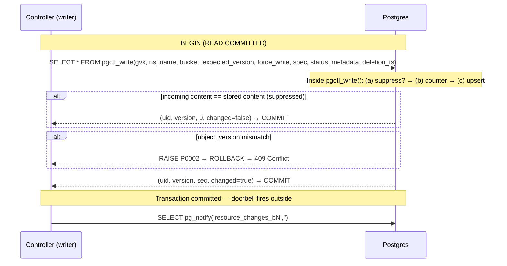
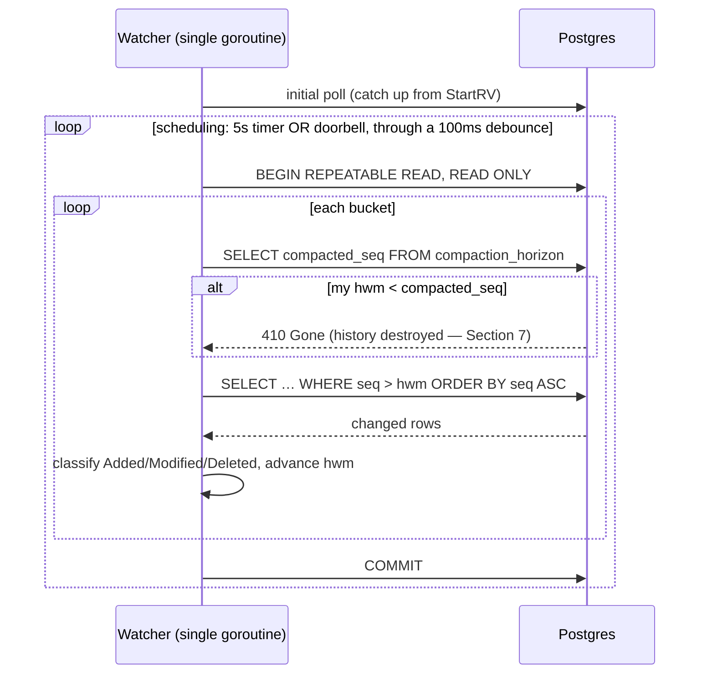
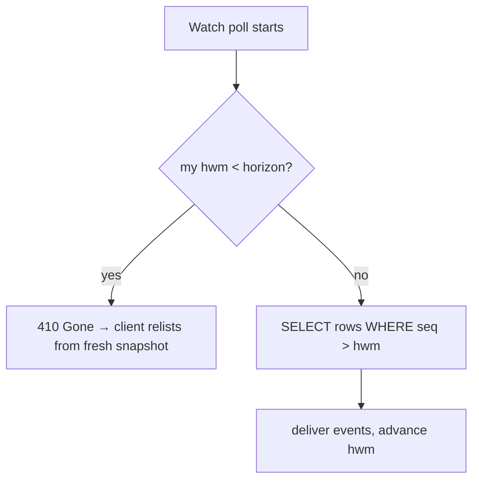

# A Walkthrough: Kubernetes List/Watch on Plain Postgres

This document explains, from first principles, how this system re-implements the
Kubernetes List/Watch API on top of an ordinary PostgreSQL database. It is
written for someone who is comfortable with SQL and Kubernetes concepts but has
_not_ internalized why each mechanism in the design exists.

Read it top to bottom — every section motivates the next. Postgres-specific
concepts (`fillfactor`, isolation levels, `EXCLUDED`, CTEs) are introduced in
**asides** at the point where they first matter; if you know Postgres well, skip
them. Code references name the file only (line numbers drift); the relevant
files are:

- `internal/schema/migrations/001_initial.sql` — the schema
- `internal/writer/writer.go` — the write path
- `internal/reader/list.go` — the List path
- `internal/reader/watcher.go` — the Watch path
- `internal/compaction/compactor.go` — garbage collection
- `internal/verifier/verifier.go` — the continuous invariant verifier
- `internal/resourceversion/rv.go` — the resourceVersion type

---

## 0. The one-sentence mental model

> **We are re-implementing the Kubernetes List/Watch API on top of Postgres,
> and everything in the design exists to fake the one thing etcd gives you for
> free: a commit-ordered version number.**

Hold onto that sentence. Every table, every lock, and every bit of garbage
collection traces back to it.

---

## 1. The contract we must honor

A Kubernetes client (controller-runtime's informer) does exactly two things:

1. **LIST** — "give me every object right now, and a bookmark called
   `resourceVersion` (RV) marking this exact instant."
2. **WATCH from RV** — "now stream me every change that happened _after_ that
   bookmark, in commit order, forever, with no gaps and no duplicates."

etcd provides this natively: it is an MVCC store with one global, monotonic
`revision` counter. Every write gets the next revision; a watch is just "replay
the log from revision X onward." Postgres has no such thing, so the whole design
is machinery to _manufacture_ that revision number and that replayable log using
ordinary tables.

The three ways a naive attempt breaks (this is Section 1 of `DESIGN.md`, in plain
terms):

- **Out-of-order commits.** If you hand out version numbers with a plain counter,
  transaction A can take version 5 and transaction B take version 6, but B
  commits _first_. A watcher sees 6, advances its bookmark to 6, and when A
  finally commits its 5 it is below the bookmark — **missed forever.**
- **No single global counter.** For scale, objects are sharded into _buckets_,
  and we want per-bucket ordering without one global write lock. So there is no
  single revision number — there is one _per (GVK, bucket)_.
- **Failover.** If the database fails over and the counter rewinds even slightly,
  a reused number carrying different content silently corrupts every watcher's
  cache.

Everything below is the machinery that defeats those three hazards.

---

## 2. The tables at a glance

Only three tables carry the core idea; the rest are supporting cast. Full DDL is
in `internal/schema/migrations/001_initial.sql`.

| Table                  | Its one job                                                              | etcd analogy            |
| ---------------------- | ------------------------------------------------------------------------ | ----------------------- |
| `kubernetes_resources` | The object in one of three lifecycle states (live, dying, fully deleted) | the keyspace            |
| `gvk_bucket_counters`  | The commit-ordered version number, one row per (bucket, GVK)             | the global revision     |
| `compaction_horizon`   | How far back history has been destroyed                                  | the compaction revision |

The central row, in `kubernetes_resources`, has three columns worth calling out:

- **`gvk_bucket_seq`** — the object's position in its bucket's ordered log. This
  _is_ the per-bucket version number. Bumped on every write.
- **`object_version`** — a _separate_ per-object counter used only for optimistic
  concurrency ("update only if you still have the current version, else 409").
  Do not confuse it with `gvk_bucket_seq`; they solve different problems.
- **`deletion_timestamp`** — determines the object's lifecycle state (the key
  to garbage collection — Section 7):
  - `NULL` — **live** object, visible and active.
  - Set, with active finalizers in `metadata->'finalizers'` — **dying** object.
    Still visible to Get/List so controllers can perform cleanup.
  - Set, with no finalizers — **fully deleted** (tombstone). Invisible to
    clients, eligible for compaction.

---

## 3. The linchpin: the composite resourceVersion

Because there is no single global counter, the bookmark cannot be one number. It
is a **vector** — one high-water mark per bucket (see `internal/resourceversion/rv.go`):

```
b2:1044,b5:902,b9:4123
└─ bucket 2 is at seq 1044, bucket 5 at 902, bucket 9 at 4123
```

Read it as: _"I have seen everything up to seq 1044 in bucket 2, 902 in bucket
5, and 4123 in bucket 9."_

The **per-bucket map** exists because sequences are per-bucket — a client
tracks a position in each bucket it watches. Failover safety (I2/I4) relies on
RDS Multi-AZ synchronous replication, which guarantees no committed sequence is
ever lost. On database restore from backup, all controller pods must be
restarted so caches relist from the current state.

The serialization is canonical (buckets sorted) so equal states compare equal.

---

## 4. The write path

A stored procedure plus one post-commit notification (`internal/writer/writer.go`,
`internal/schema/migrations/001_initial.sql`).



The transaction runs at `READ COMMITTED`, Postgres's default isolation level —
ordering here comes from **row locks**, not from snapshots. (Isolation levels are
explained in the aside in Section 5, where the contrast with the read paths
becomes visible.)

The stored procedure (`pgctl_write()`) consolidates three formerly-separate
SQL statements into one server-side call, eliminating two network round-trips
per write. The doorbell fires **after** the commit, in a separate statement —
this avoids a global lock on Postgres's notification queue that otherwise
serializes all concurrent commits (see Section 4d).

### (a) No-op suppression — "did anything actually change?"

The writer reads the current row and compares content. If identical, it commits
_without_ touching the counter and reports `Changed=false`. This matches
Kubernetes: an update that changes nothing does not advance resourceVersion.
It runs _before_ the counter (so a no-op burns no sequence number — no gap). This is a
big deal in practice: status re-appliers that rewrite identical content every few
minutes produce zero database writes and zero watch events.

### (b) The counter — the heart of the whole design

```sql
INSERT INTO gvk_bucket_counters (bucket_id, gvk, current_seq) VALUES ($1,$2,1)
ON CONFLICT (bucket_id, gvk) DO UPDATE SET current_seq = current_seq + 1
RETURNING current_seq;
```

This is how out-of-order commits are defeated; read it twice. The `DO UPDATE`
takes an **exclusive row lock** on that bucket's counter row and Postgres holds
it until COMMIT. Picture two writers to the same bucket:

- Writer A increments to seq 5, keeps the row lock, keeps working.
- Writer B tries to increment — it **blocks**, because A holds the lock.
- B cannot proceed until A commits (or aborts).
- So B necessarily receives seq 6 _and_ commits after A.

Therefore **if seq(A) < seq(B), then A committed before B** — sequence order
equals commit order, with no holes (a rollback undoes the increment too). That is
invariant I1 (commit-ordered sequences). A plain Postgres `SEQUENCE` cannot do this: sequences are
non-transactional and hold nothing to commit, so A could take 5, B take 6, and B
commit first. This one row lock is the price of rebuilding etcd's ordered
revision — and it is also why per-bucket write throughput has a ceiling (writers
to one hot bucket serialize here). Sharding into many buckets is what keeps that
ceiling high in aggregate.

> **Postgres aside — `fillfactor`, or why the counter table is deliberately
> half-empty.** The schema declares this table `WITH (fillfactor = 50)`. A table
> is stored as 8 KB **pages**; `fillfactor` says how full to pack each page on
> insert (default 100 = completely full; 50 = leave half empty). Why waste space
> on purpose? Because Postgres is **MVCC**: an `UPDATE` never overwrites a row in
> place — it writes a _new version_ of the row and marks the old one dead.
> Normally the new version must also be inserted into **every index** on the
> table, since it lives at a new physical location. The escape hatch is a **HOT
> update** (Heap-Only Tuple): if the new version (a) fits on the _same page_ as
> the old one and (b) changed no indexed column, Postgres stores it beside the
> old one and skips all index maintenance — much cheaper, and the dead versions
> are cleaned up cheaply too. The counter is the hottest table in the system —
> every write does `current_seq + 1`. The changed column is not indexed and the
> PK never changes, so (b) always holds; `fillfactor = 50` guarantees (a) by
> always leaving room on the page. Result: **every counter bump is a HOT
> update.** The cost (~2× the pages) is negligible — the table has one row per
> (bucket, GVK).

### (c) The upsert with optimistic concurrency

Writes the new content, stamps the fresh `gvk_bucket_seq`, and bumps
`object_version`. The `WHERE object_version = $expected` clause means a stale
updater (who read version 3 while it is now 5) matches zero rows and gets a 409 —
invariant I6, no lost updates.

### (d) The doorbell

`pg_notify` on the bucket's channel, empty payload. This is _only_ a latency
optimization: it tells watchers "wake up and poll now" instead of waiting for
their timer. Correctness never depends on it; if the notification is lost, the
timer still fires.

The doorbell fires **after** the transaction commits, in a separate statement —
not inside the stored procedure. Why? `pg_notify` inside a transaction acquires
a global exclusive lock on Postgres's internal notification queue at pre-commit
time. With many buckets writing concurrently, every commit serializes on that
one lock — throughput collapses to a single-threaded ceiling regardless of bucket
count. Moving `pg_notify` outside the transaction means the lock is held only for
the brief standalone statement, not for the entire commit. The worst case of a
lost doorbell (the writer crashes between COMMIT and `pg_notify`) is harmless:
the watcher's baseline timer fires within 5 s.

---

## 5. The List path (the easy one)

List is a single `REPEATABLE READ` read-only transaction
(`internal/reader/list.go`) that does two reads in one snapshot:

1. Read `gvk_bucket_counters` for the buckets → the per-bucket high-water marks.
2. Read live and dying rows (fully-deleted tombstones are excluded by the query).

Because both happen in the _same snapshot_, the data and the RV describe the
exact same instant — no skew. The client gets its objects plus a bookmark it can
hand straight to Watch. The query filters tombstones at the SQL level:
`AND (deletion_timestamp IS NULL OR metadata->'finalizers' != '[]'::jsonb)` —
live objects pass the first branch, dying objects (deletion_timestamp set but
still carrying finalizers) pass the second. Fully-deleted tombstones (no
finalizers) are excluded, matching the Kubernetes contract where a deleted object
with no finalizers is gone.

> **Postgres aside — isolation levels (`READ COMMITTED` vs. `REPEATABLE
READ`).** A transaction's isolation level controls how much of _other_
> concurrent transactions' committed work it can see. Under **`READ COMMITTED`**
> (the default), each _statement_ gets a fresh snapshot — if someone commits
> between your first and second `SELECT`, the second sees the newer data. Under
> **`REPEATABLE READ`**, the _entire transaction_ sees one snapshot frozen at its
> first query; everything committed afterward is invisible to it. The read paths
> (List here, Watch in Section 6) use `REPEATABLE READ` because they do several
> reads — counters or horizon, then rows — that must all describe the
> **same instant**; under `READ COMMITTED` a compaction could commit between two
> of those reads and produce a torn view. The write path deliberately uses
> `READ COMMITTED` instead: a writer _wants_ the latest committed counter value,
> and its ordering comes from row locks, not snapshots — under `REPEATABLE READ`,
> concurrent writers to the same hot counter row would abort with serialization
> failures.

---

## 6. The Watch path

There is exactly **one** correctness mechanism: **polling.**
`SELECT everything WHERE seq > my_bookmark ORDER BY seq`. The doorbell and the
timer only decide _when_ to poll; they never carry data.



Key design choices (`internal/reader/watcher.go`):

- **A single goroutine owns everything** — one loop, one timer, one `hwm` map.
  The LISTEN connection runs in a side goroutine whose only job is to nudge a
  1-buffered channel. So the `hwm` map is never touched concurrently — no locks,
  no data races.
- **The debounce**: if a doorbell arrives and it has been ≥100 ms since the last
  poll, poll immediately (leading edge). If less, set a "pending" flag and
  schedule one poll at the 100 ms mark (trailing edge). This collapses a burst of
  doorbells into roughly one poll without ever losing the guarantee that a poll
  follows.
- **The whole poll is one `REPEATABLE READ` snapshot** — that is what makes the
  horizon check and the row read consistent, so a compaction running _during_ a
  poll is invisible to it.
- **Coalescing is correct, not a bug.** If an object is written five times
  between two polls, the watcher sees only the latest state (one row, one seq).
  Kubernetes watch semantics explicitly allow this — you deliver current state,
  not every intermediate edit. This is also why delivered seq numbers are _not_
  contiguous — a fact the verifier (Section 10) has to respect.

Event type classification is more nuanced than a simple "deleted or not" check.
The raw watcher delivers every changed row; the **pgruntime layer** above it
classifies events using both `deletion_timestamp` and finalizer state:

- `deletion_timestamp` set **with** active finalizers — **OnUpdate** (the
  object is _dying_ but controllers still need to see it and do cleanup).
- `deletion_timestamp` set **with no** finalizers — **OnDelete** (the object
  is fully gone).
- `object_version == 1` — **Added**; else **Modified**.

A create+update that coalesces into one poll can arrive labeled Modified.
Informers tolerate this.

---

## 7. Garbage collection — the subtle part

Built one brick at a time, because this is where people get lost.

### 7.1 Why deletes are a problem at all

A watcher only ever runs `SELECT … WHERE seq > hwm`. It can only see **rows that
exist.** So what happens if a delete is a plain `DELETE FROM kubernetes_resources`?

The row vanishes. The next poll finds nothing at that key, and **the watcher
never learns the object was deleted.** Its cache keeps a ghost copy forever. You
have silently corrupted it. Conclusion: **you cannot hard-delete.** A delete has
to be a _visible event in the log_, exactly like a create or an update.

### 7.2 The fix: soft delete with a three-state lifecycle

Instead of removing the row, a delete **bumps the sequence and sets
`deletion_timestamp`.** But the object does not become invisible immediately —
its lifecycle depends on whether it still has **finalizers** (cleanup hooks
registered by controllers):


The three states:

- **Live** (`deletion_timestamp IS NULL`) — normal active object, visible to
  Get/List.
- **Dying** (`deletion_timestamp IS NOT NULL`, has finalizers) — marked for
  deletion but controllers have not finished cleanup. Still visible to Get/List
  so controllers can act on it. The pgruntime layer dispatches **OnUpdate** (not
  OnDelete) when an object enters this state.
- **Fully deleted / tombstone** (`deletion_timestamp IS NOT NULL`, no
  finalizers) — cleanup is complete. Invisible to clients (the pgruntime layer
  excludes it from Get/List and dispatches **OnDelete**). The row still
  physically exists for watchers to pick up the deletion event. If a new
  resource is created with the same `(gvk, namespace, name)`, the tombstone is
  **revived**: overwritten with a fresh UID, `object_version = 1`, cleared
  `deletion_timestamp`, and the caller's spec/status/metadata. Dying objects
  (with finalizers) block re-creation with `AlreadyExists`.

### 7.3 The new problem tombstones create

Fully-deleted tombstones never leave on their own. Every object that completes
its deletion lifecycle leaves a permanent row. Delete a million objects over a
year and you have a million dead rows bloating the table and its indexes. So you
_must_ eventually remove old tombstones. That removal is the garbage
collection — here called **compaction**.

### 7.4 The danger compaction reintroduces — the crux

Say you physically delete the tombstone at seq 12. Now a **slow watcher** appears
whose bookmark is `hwm=9`. It runs `WHERE seq > 9`, and seq 12 is gone. It never
sees the delete — **ghost object forever again.** The exact bug tombstones were
meant to fix, just moved later in time. This is the "silent gap" hazard,
invariant I5.

Critically, the compactor only hard-deletes rows that are **fully deleted** —
`deletion_timestamp IS NOT NULL` _and_ no active finalizers. A dying object
(with finalizers still present) survives past the retention window because a
controller may still be performing cleanup. The finalizer guard:

```sql
AND (metadata->'finalizers' IS NULL OR metadata->'finalizers' = '[]'::jsonb)
```

You cannot prevent slow watchers. So instead you make the gap **loud instead of
silent.** That is the compaction horizon.

### 7.5 The compaction horizon + 410 Gone

When compaction physically deletes tombstones up to seq N, it records, for that
(bucket, GVK):

> `compaction_horizon.compacted_seq = N` — "history at or below N has been
> destroyed; nobody below N can be safely caught up."

Then every watch poll, _before_ reading rows, compares its bookmark to the
horizon (`internal/reader/watcher.go`):

```sql
SELECT compacted_seq FROM compaction_horizon WHERE bucket_id=$1 AND gvk=$2;
-- if my hwm < compacted_seq  →  return 410 Gone
```

`410 Gone` is a real Kubernetes status. The client knows what it means: _"your
bookmark is too old — throw away your cache, LIST again from scratch, and resume
watching from the fresh RV."_ So the slow watcher gets a clean, correct restart
instead of a silent ghost. Loud, not silent — that is the whole trick.



### 7.6 Why delete + horizon must be one atomic statement

Suppose the physical DELETE committed but the horizon update lagged by even a
moment. In that window: tombstones are gone, but the horizon still says "history
intact." A slow watcher passes the horizon check, then reads and finds nothing —
**silent gap.** Back to square one.

So compaction does both in a **single CTE** (`internal/compaction/compactor.go`):

```sql
WITH del AS (
    DELETE FROM kubernetes_resources
    WHERE deletion_timestamp IS NOT NULL
      AND deletion_timestamp < now() - $1::interval   -- retention
      AND (metadata->'finalizers' IS NULL              -- finalizer guard
           OR metadata->'finalizers' = '[]'::jsonb)
    RETURNING bucket_id, gvk, gvk_bucket_seq
),
horizon AS (
    INSERT INTO compaction_horizon (bucket_id, gvk, compacted_seq)
    SELECT bucket_id, gvk, max(gvk_bucket_seq) FROM del GROUP BY 1,2
    ON CONFLICT (bucket_id, gvk)
    DO UPDATE SET compacted_seq = GREATEST(
        compaction_horizon.compacted_seq,   -- value already stored
        EXCLUDED.compacted_seq)             -- value I just tried to insert
)
SELECT count(*) FROM del;
```

Top to bottom:

- `del` deletes fully-deleted tombstones (no finalizers) older than
  **retention** and returns the seqs it killed. The finalizer guard ensures
  dying objects — those still being cleaned up by controllers — are never
  compacted, even if their `deletion_timestamp` is past the retention window.
- `horizon` advances the horizon to the highest seq just deleted, per
  (bucket, GVK).
- `GREATEST(...)` guarantees the horizon **never moves backward**, even if two
  compactors run concurrently.

> **Postgres aside — CTEs vs. transactions, and `EXCLUDED`.** A **CTE** (Common
> Table Expression, the `WITH name AS (...)` syntax) structures a **single SQL
> statement** by naming sub-queries and feeding one into the next — the whole
> block above is _one_ statement. A **transaction** (`BEGIN ... COMMIT`) binds
> **many statements** into one atomic unit. The connection that makes the
> compactor work: **a single statement is always atomic by itself** (Postgres
> wraps a lone statement in an implicit transaction), so the CTE gets
> delete-and-advance-horizon atomicity for free — exactly the I5 guarantee. The
> write path uses a stored procedure (`pgctl_write()`) that performs multiple
> operations server-side, wrapped in a transaction for atomicity. Rule of thumb:
> a CTE organizes (and atomically binds) one statement; a transaction atomically
> binds several; a stored procedure pushes multi-step logic to the server to save
> round-trips.
>
> **`EXCLUDED`** is a pseudo-table available only inside
> `INSERT ... ON CONFLICT DO UPDATE`: it holds **the row you _tried_ to insert
> but that collided** — the proposed values. Above,
> `compaction_horizon.compacted_seq` is the stored value and
> `EXCLUDED.compacted_seq` is the value this run proposed; taking
> `GREATEST` of the two is how the horizon advances but never retreats. (The
> writer's counter uses the other idiom — `DO UPDATE SET current_seq =
gvk_bucket_counters.current_seq + 1` references the _stored_ value to
> increment it, so it never needs `EXCLUDED`.)

Because it is one statement, the horizon is never behind the physical delete, so
the watcher's horizon check can always be trusted.

### 7.7 Retention — why 24 hours, not zero

Why keep tombstones for 24 h instead of compacting immediately? Because
**retention is the grace period for legitimate slow watchers.** A controller that
restarts, or a watcher that briefly disconnects, needs time to resume before its
history is destroyed. The rule:

> **Retention must exceed the slowest legitimate watcher's resume interval.**
> Alarm when any watcher's bookmark age approaches retention/2.

Too short → you 410 healthy watchers constantly (relist storms). Too long →
tombstones pile up. 24 h is a starting default, tuned against how long your
informers can realistically be offline.

### 7.8 The _other_ "garbage collection" — don't confuse the two

There are two independent cleanup mechanisms:

|                      | **Tombstone compaction** (this section)               | **Postgres autovacuum**                 |
| -------------------- | ----------------------------------------------------- | --------------------------------------- |
| Level                | Application logic                                     | Storage engine                          |
| Removes              | Fully-deleted objects (tombstones with no finalizers) | Dead _tuple versions_ from every UPDATE |
| Triggered by         | Your compactor job                                    | Postgres, automatically                 |
| Invariant it upholds | I5 (no silent gap)                                    | none — pure space reclamation           |

Every `UPDATE` in Postgres writes a new row version and leaves the old one dead
(MVCC, as in the `fillfactor` aside in Section 4); autovacuum reclaims that space
later. This is storage hygiene, wholly separate from tombstone GC. When this
design says "compaction" it means tombstone compaction; autovacuum is Postgres's
own housekeeping that you tune, not implement.

---

## 8. A worked example: one object, cradle to 410

Trace a single object in bucket 2 to see all the pieces interact.

1. **Create.** No existing row, so no-op suppression does not fire. Counter for (bucket 2, GVK) goes
   `0 → 1`. Row inserted with `gvk_bucket_seq=1`, `object_version=1`,
   `deletion_timestamp=NULL`. Doorbell fires. A watcher at `hwm=0` polls, sees
   seq 1, emits **Added**, advances to `hwm=1`.

2. **Update.** Content differs, so not suppressed.
   Counter `1 → 2`. Row updated: `gvk_bucket_seq=2`, `object_version=2`. Watcher
   polls, sees seq 2, emits **Modified**, advances to `hwm=2`.

3. **No-op re-apply.** A status re-applier writes byte-identical content.
   The content check matches; the transaction commits with **no**
   counter increment and **no** doorbell. Counter stays at 2. Watchers see
   nothing. `Changed=false`.

4. **Delete (with finalizer).** The object has a finalizer
   (`["cleanup.example.com"]`). The write sets `deletion_timestamp=now()`. Counter
   `2 → 3`. The row is now **dying** at `gvk_bucket_seq=3` — it has a deletion
   timestamp but still has active finalizers. The pgruntime watcher dispatches
   **OnUpdate** (not OnDelete), because the object is still visible and
   controllers need to act on it.

5. **Controller cleanup.** A controller sees `deletionTimestamp` is set, performs
   its cleanup work, and removes its finalizer via an Update call. Counter
   `3 → 4`. The object now has `deletion_timestamp` set and no finalizers — it is
   **fully deleted** (a tombstone) at `gvk_bucket_seq=4`. The pgruntime watcher
   dispatches **OnDelete**. The row still physically exists.

6. **Time passes; compaction runs.** More than 24 h later the compactor's CTE
   checks that the row has no finalizers, deletes the tombstone (seq 4), and in
   the same statement sets `compaction_horizon(bucket 2, GVK) = 4`.

7. **A slow watcher returns.** A watcher that had been offline since `hwm=1`
   resumes. Its first poll compares `hwm=1` to the horizon `4`; since `1 < 4` it
   receives **410 Gone**. It re-LISTs (getting the current empty state and a
   fresh RV) and resumes watching cleanly — never a ghost object, never a silent
   gap.

That single lifecycle exercises the counter, no-op suppression,
finalizer-based dying/tombstone states, compaction, the horizon, and 410. If it
makes sense, the rest of the system is variations on it.

---

## 9. How it all ties back to the one sentence

| Mechanism                    | Which piece of "a commit-ordered version" it defends                                                                                                |
| ---------------------------- | --------------------------------------------------------------------------------------------------------------------------------------------------- |
| Counter row + exclusive lock | Commit-ordered sequences: commit-order = seq-order (I1)                                                                                             |
| `object_version` check       | No lost updates on one object (I6)                                                                                                                  |
| RDS synchronous replication  | Version never goes backward across failover (I2, I4); on restore, restarting pods forces a relist                                                   |
| Tombstones + finalizers      | Deletes are visible events; dying objects (with finalizers) stay visible for cleanup, fully-deleted tombstones (no finalizers) signal deletion (I3) |
| Compaction horizon + 410     | A watcher that fell too far behind is told loudly, never silently skipped; compaction only removes finalizer-free tombstones (I5)                   |
| Poll loop                    | The delivery guarantee — the doorbell is only latency (I3)                                                                                          |

Every mechanism is one repair to the gap between "what a Kubernetes client
expects" and "what a plain SQL table gives you."

---

## 10. The verifier — who checks the checkers, forever

The table above lists the promises and their defenders. The obvious next
question: **who confirms, in production, that the promises are actually being
kept?** Tests force each race once, before release — but correctness that is only
verified pre-release decays: configs drift, code changes, production finds states
no test imagined. So the design runs a **verifier** as a permanent, low-priority
consumer in every environment (`internal/verifier/verifier.go`).

The elegant part: **the verifier is just another watcher.** It subscribes to a
sample of buckets (including the hottest) through the ordinary poll path — the
same code every real controller uses — and audits the event stream it receives.
It exercises the machinery it is auditing.

What it checks per (GVK, bucket):

- **Monotonic high-water marks (I2).** Every delivered event's seq must be
  strictly greater than the previous high-water mark for its bucket. One rule
  catches two failure classes: a _regression_ (the sequence went backwards)
  and a _duplicate delivery_ both manifest as `seq <= previous hwm`. That single comparison is the whole check, which is
  why verifier state is tiny — **O(buckets)**, one number per bucket, no per-key
  maps that grow with fleet size.
- **Compaction consistency (I5)** comes free from the poll path itself: if the
  verifier's bookmark ever falls below a horizon, it must receive a loud `410
Gone` — silence there would itself be the violation.

Just as important is what it deliberately does **not** check: per-event
contiguity. Recall from Section 6 that coalescing is legal — two rapid writes to
one object leave only the latest seq visible, so delivered seqs legitimately skip
numbers. A naive contiguity audit would false-alarm constantly. Contiguity
auditing, if ever needed, must cross-check the table to prove a missing seq was
superseded — out of scope for the stream-side verifier. (This is a nice example
of the invariants doing real work: I3 _permits_ coalescing, so the verifier must
tolerate it.)

The second probe is a **canary**: at a low rate, the verifier writes a synthetic
object per sampled bucket through the real write path and measures
write-to-delivery latency — the wall-clock time from `Write` returning to the
event appearing on the watcher channel. This times the full pipeline: commit
visibility, `pg_notify` doorbell, poll scheduling, and channel delivery. Latency
samples are kept in a bounded ring buffer (1,000 entries, p99) and also observed
via the `pgctl_verifier_canary_delivery_seconds` Prometheus histogram. The
doorbell is never required for correctness (Section 4d) and would fail
_silently_ if nobody measured latency — events would still arrive, just up to
5 s late. The canary is what turns "doorbell quietly broken" from an invisible
degradation into a metric.

Operationally: any violation pages a human; a sequence regression additionally
trips a **write-freeze** on the affected bucket (with synchronous replication it
should be impossible, so if it fires, something is deeply wrong — stop writes
first, debug second). The same verifier code is also the acceptance oracle for
every certification phase in `DESIGN.md` — the judge in the load tests and the
judge in production are the same program, so passing the tests means something.

---

## 11. Where this sits versus kine

Worth stating plainly, since the obvious question is "isn't this just kine?"

**kine** is a shim that speaks the etcd API on top of a SQL database. The path is
`clients → kube-apiserver → kine → Postgres`; the real Kubernetes API server
stays in place, and kine only replaces etcd. **This design** has controllers talk
to Postgres _directly_ through the custom client — there is no API server and no
etcd protocol in the path.

So compared to kine you drop **two** moving pieces (the etcd shim _and_ the API
server), and the write/watch path can scale better for one concrete structural
reason: **kine stores everything in one table with a single global
auto-incrementing revision** — every write in the cluster contends on that one
sequence. This design _shards that counter per (GVK, bucket)_, so writes to
different buckets never contend. That is the core performance advantage.

The trade is real and it is the whole "iff you accept the assumptions" clause:
dropping the API server drops everything it does — admission/validation webhooks,
RBAC, defaulting, CRDs, field/label selectors, server-side apply, and
compatibility with the whole `kubectl`/operator ecosystem. kine keeps all of that
because the apiserver stays. You lose the apiserver's
in-memory watch cache (which serves many watchers from one upstream watch), so
very high watcher fan-out may need a caching layer here to match.

**Net:** if you own every controller, do not need the Kubernetes API surface, and
your resources shard cleanly into buckets, this replaces kine _and_ the apiserver
with fewer moving parts and better write/watch scaling. It is not a drop-in kine
swap — it is a leaner point in the design space that is only reachable once those
assumptions hold.
