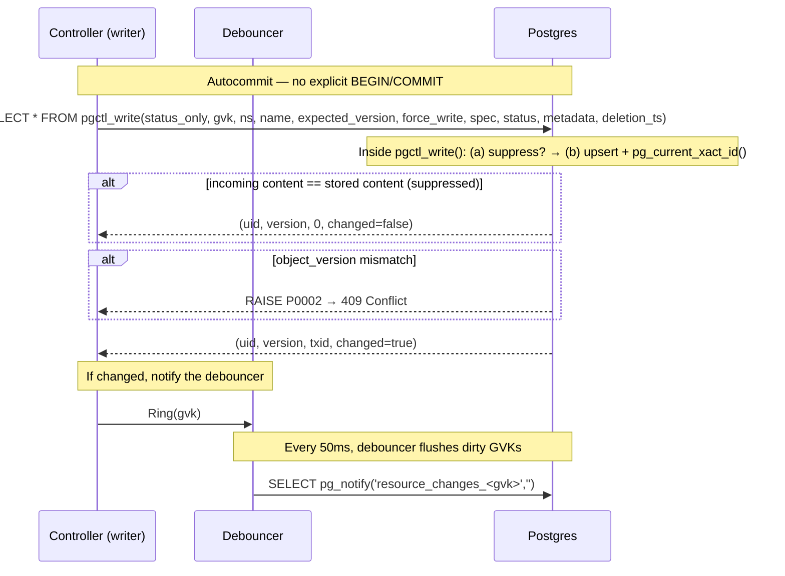
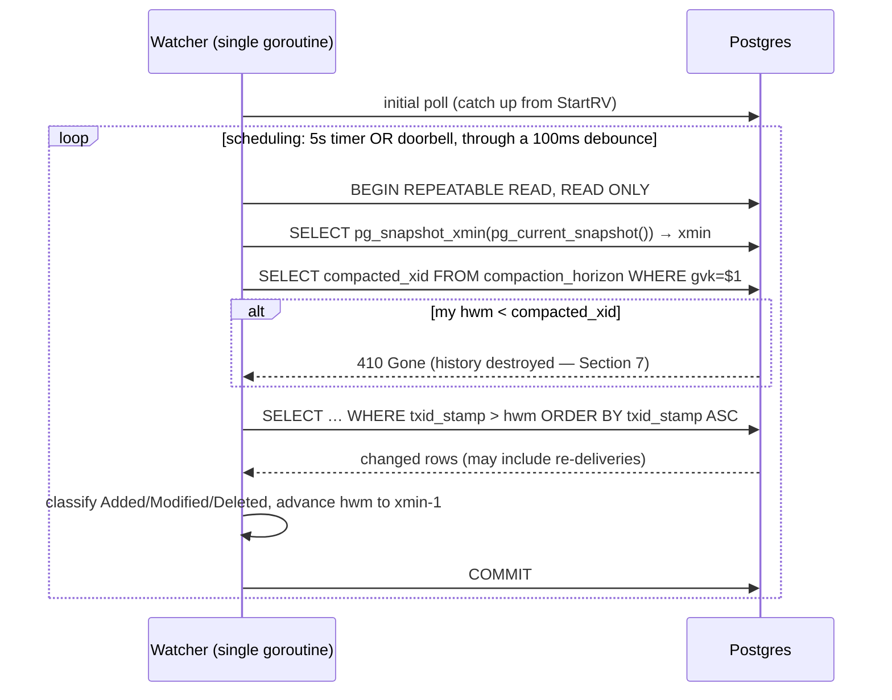
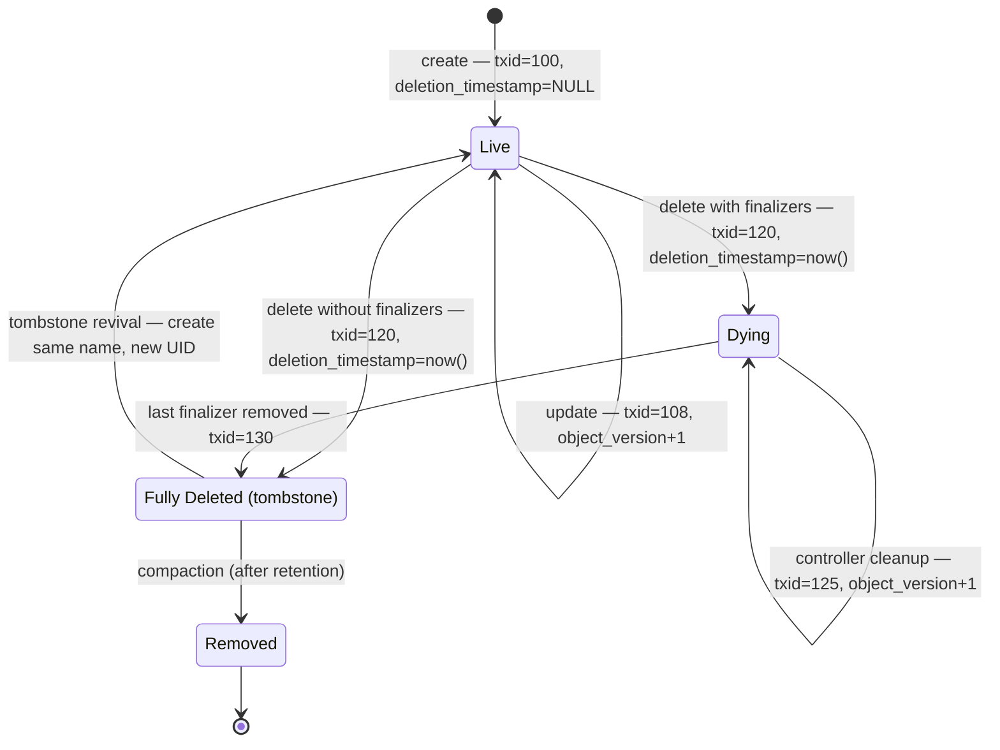
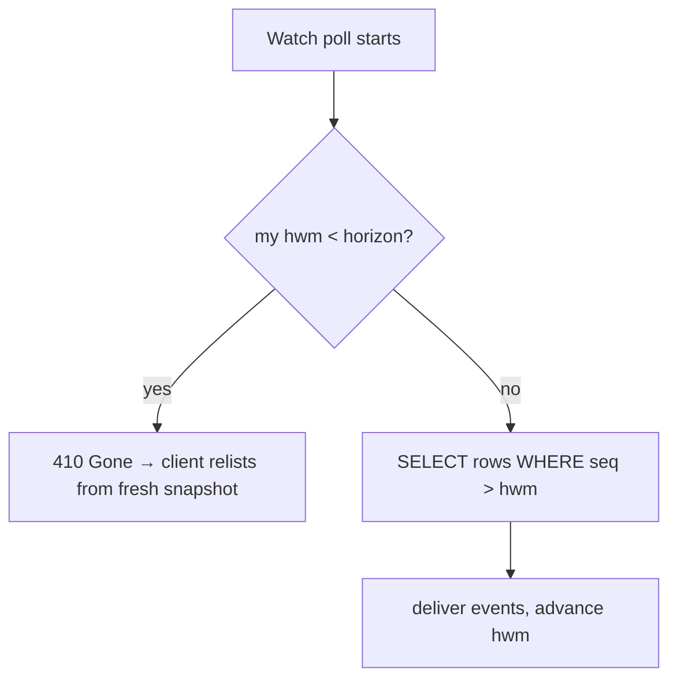

# A Walkthrough: Kubernetes List/Watch on Plain Postgres

This document explains, from first principles, how this system re-implements the
Kubernetes List/Watch API on top of an ordinary PostgreSQL database. It is
written for someone who is comfortable with SQL and Kubernetes concepts but has
_not_ internalized why each mechanism in the design exists.

Read it top to bottom — every section motivates the next. Postgres-specific
concepts (`fillfactor`, isolation levels, `EXCLUDED`, CTEs) are introduced in
**asides** at the point where they first matter; if you know Postgres well, skip
them. Code references name the file only (line numbers drift); the relevant
files are:

- `internal/schema/migrations/001_initial.sql` — the schema
- `internal/writer/writer.go` — the write path
- `internal/reader/list.go` — the List path
- `internal/reader/watcher.go` — the Watch path
- `internal/compaction/compactor.go` — garbage collection
- `internal/verifier/verifier.go` — the continuous invariant verifier
- `internal/resourceversion/rv.go` — the resourceVersion type

---

## 0. The one-sentence mental model

> **We are re-implementing the Kubernetes List/Watch API on top of Postgres,
> and everything in the design exists to fake the one thing etcd gives you for
> free: a commit-ordered version number.**

Hold onto that sentence. Every table, every lock, and every bit of garbage
collection traces back to it.

---

## 1. The contract we must honor

A Kubernetes client (controller-runtime's informer) does exactly two things:

1. **LIST** — "give me every object right now, and a bookmark called
   `resourceVersion` (RV) marking this exact instant."
2. **WATCH from RV** — "now stream me every change that happened _after_ that
   bookmark, in commit order, forever, with no gaps and no duplicates."

etcd provides this natively: it is an MVCC store with one global, monotonic
`revision` counter. Every write gets the next revision; a watch is just "replay
the log from revision X onward." Postgres has no such thing, so the whole design
is machinery to _manufacture_ that revision number and that replayable log using
ordinary tables.

The three ways a naive attempt breaks (this is Section 1 of `DESIGN.md`, in plain
terms):

- **Out-of-order commits.** If you hand out version numbers with a plain counter,
  transaction A can take version 5 and transaction B take version 6, but B
  commits _first_. A watcher sees 6, advances its bookmark to 6, and when A
  finally commits its 5 it is below the bookmark — **missed forever.**
- **In-flight transactions.** Even with PostgreSQL's native transaction IDs, a
  watcher can't simply advance to the highest txid it's seen — a lower-numbered
  transaction might still be in-flight. The watermark must only advance to a
  point where all prior transactions are guaranteed committed.
- **Failover.** If the database fails over and transaction IDs rewind even
  slightly, a reused number carrying different content silently corrupts every
  watcher's cache.

Everything below is the machinery that defeats those three hazards.

---

## 2. The tables at a glance

Only two tables carry the core idea; the rest are supporting cast. Full DDL is
in `internal/schema/migrations/001_initial.sql`.

| Table                  | Its one job                                                              | etcd analogy            |
| ---------------------- | ------------------------------------------------------------------------ | ----------------------- |
| `kubernetes_resources` | The object in one of three lifecycle states (live, dying, fully deleted) | the keyspace            |
| `compaction_horizon`   | How far back history has been destroyed                                  | the compaction revision |

The central row, in `kubernetes_resources`, has three columns worth calling out:

- **`txid_stamp`** — the PostgreSQL transaction ID (`xid8`) assigned at write
  time via `pg_current_xact_id()`. This is the ordering stamp — watchers use it
  to find changed rows. Unlike a counter, it is assigned by PostgreSQL itself
  and requires no shared row lock.
- **`object_version`** — a per-object counter used for optimistic concurrency
  ("update only if you still have the current version, else 409"). Do not
  confuse it with `txid_stamp`; they solve different problems.
- **`deletion_timestamp`** — determines the object's lifecycle state (the key
  to garbage collection — Section 7):
  - `NULL` — **live** object, visible and active.
  - Set, with active finalizers in `metadata->'finalizers'` — **dying** object.
    Still visible to Get/List so controllers can perform cleanup.
  - Set, with no finalizers — **fully deleted** (tombstone). Invisible to
    clients, eligible for compaction.

---

## 3. The linchpin: the composite resourceVersion

The bookmark is a single number — a **watermark** derived from PostgreSQL's
`pg_snapshot_xmin()` (see `internal/resourceversion/rv.go`):

```
12345678
└─ everything at or below this transaction ID is committed and delivered
```

Read it as: _"I have seen every committed transaction up through 12345678."_

The watermark is `xmin - 1`, where `xmin` is the oldest in-flight transaction ID
from the watcher's snapshot. Everything below `xmin` is guaranteed committed, so
the watcher knows its view is complete up to that point. Failover safety
(I2/I4) relies on RDS Multi-AZ synchronous replication, which guarantees no
committed transaction is ever lost. On database restore from backup, all
controller pods must be restarted so caches relist from the current state.

One wrinkle: when the pgruntime layer stamps the RV on a single object
delivered by a watch event (the informer machinery stores each event object's RV
as its reconnect bookmark), the object's own version rides along as an
`o<version>;` prefix — `o5;12345678` — so that the object remains usable for
optimistic-concurrency writes. Watch resumption ignores the prefix
(DESIGN.md §3.2).

---

## 4. The write path

A stored procedure in autocommit mode, plus a debounced doorbell
(`internal/writer/writer.go`, `internal/schema/migrations/001_initial.sql`).



The call runs in **autocommit mode** — a single `conn.QueryRow` with no
explicit `BEGIN`/`COMMIT`. This eliminates 2 round-trips per write (the `BEGIN`
and `COMMIT` that would otherwise bracket the stored procedure call). On Aurora
with cross-AZ latency (~0.5–1ms per hop), this cuts ~2–3ms of pure network
overhead per write.

The stored procedure (`pgctl_write()`) performs no-op suppression and upsert in
one server-side call. Each row is stamped with `pg_current_xact_id()` —
PostgreSQL's native transaction ID — so **writers never contend on a shared
counter**. This is the fundamental difference from the old design: no exclusive
row lock, no serialization point, no per-shard throughput ceiling.

### (a) No-op suppression — "did anything actually change?"

The writer reads the current row and compares content. If identical, it commits
_without_ touching the counter and reports `Changed=false`. This matches
Kubernetes: an update that changes nothing does not advance resourceVersion.
It runs _before_ the counter (so a no-op burns no sequence number — no gap). This is a
big deal in practice: status re-appliers that rewrite identical content every few
minutes produce zero database writes and zero watch events.

### (b) The transaction ID stamp — the heart of the whole design

Instead of a shared counter with exclusive row locks, each write is stamped with
PostgreSQL's native `pg_current_xact_id()` — the transaction's own 64-bit ID
(`xid8`). This is how out-of-order commits are defeated. The key insight:

- Every transaction gets a unique, monotonically increasing `xid8`.
- `pg_snapshot_xmin()` returns the oldest transaction ID that is still in flight.
- Everything below `xmin` is guaranteed committed.

So the watcher advances its watermark to `xmin - 1` (not to the highest txid
it's seen). This means it never skips a transaction that committed late — it
simply waits until `xmin` advances past it. Rows between the old watermark and
the new `xmin - 1` may re-appear on the next poll; the informer cache
deduplicates them.

The performance advantage is fundamental: **no shared row lock, no
serialization point.** Two writers to the same GVK run fully concurrently —
their transactions each get their own `xid8` without blocking. This eliminates
the throughput ceiling that the old counter-based design imposed per bucket.

A plain Postgres `SEQUENCE` cannot do this either: sequences are
non-transactional and hold nothing to commit, so A could take 5, B take 6, and B
commit first — the watcher would miss A. The `xid8 + snapshot-xmin` approach
solves this by making the watermark conservative: it doesn't advance past
in-flight transactions.

### (c) The upsert with optimistic concurrency

Writes the new content, stamps `txid_stamp = pg_current_xact_id()`, and bumps
`object_version`. The `WHERE object_version = $expected` clause means a stale
updater (who read version 3 while it is now 5) matches zero rows and gets a 409 —
invariant I6, no lost updates.

### (d) The doorbell

`pg_notify` on a per-GVK channel, empty payload. This is _only_ a latency
optimization: it tells watchers "wake up and poll now" instead of waiting for
their timer. Correctness never depends on it; if the notification is lost, the
timer still fires.

Writers do not call `pg_notify` directly. Instead, each write calls
`debouncer.Ring(gvk)`, which marks the GVK as dirty in a set. A background
goroutine wakes every 50ms and issues one `pg_notify` per dirty GVK, then
clears the set. This coalesces bursts of writes into at most one notification
per 50ms per GVK.

Why debouncing? Per-write `pg_notify` was catastrophic on Aurora — each
notification added a full round-trip to the distributed storage layer, capping
throughput at ~538 w/s regardless of concurrency. The debouncer recovers full
throughput (~11,061 w/s with small payloads, ~3,932 w/s with realistic 15-20KB
payloads at 48 workers on Aurora db.r6g.8xlarge).

Channel naming: short GVKs use `resource_changes_<gvk>`; long GVKs (that
exceed PostgreSQL's 63-byte identifier limit) use `rc_<sha256[:12]>`.

---

## 5. The List path (the easy one)

List is a single `REPEATABLE READ` read-only transaction
(`internal/reader/list.go`) that does two reads in one snapshot:

1. Get `pg_snapshot_xmin(pg_current_snapshot())` → the watermark (`xmin - 1`).
2. Read live and dying rows (fully-deleted tombstones are excluded by the query).

Because both happen in the _same snapshot_, the data and the RV describe the
exact same instant — no skew. The client gets its objects plus a bookmark it can
hand straight to Watch. The query filters tombstones at the SQL level:
`AND (deletion_timestamp IS NULL OR metadata->'finalizers' != '[]'::jsonb)` —
live objects pass the first branch, dying objects (deletion_timestamp set but
still carrying finalizers) pass the second. Fully-deleted tombstones (no
finalizers) are excluded, matching the Kubernetes contract where a deleted object
with no finalizers is gone.

> **Postgres aside — isolation levels (`READ COMMITTED` vs. `REPEATABLE
READ`).** A transaction's isolation level controls how much of _other_
> concurrent transactions' committed work it can see. Under **`READ COMMITTED`**
> (the default), each _statement_ gets a fresh snapshot — if someone commits
> between your first and second `SELECT`, the second sees the newer data. Under
> **`REPEATABLE READ`**, the _entire transaction_ sees one snapshot frozen at its
> first query; everything committed afterward is invisible to it. The read paths
> (List here, Watch in Section 6) use `REPEATABLE READ` because they do several
> reads — `pg_snapshot_xmin`, compaction horizon, then rows — that must all
> describe the **same instant**; under `READ COMMITTED` a compaction could commit
> between two of those reads and produce a torn view. The write path runs in
> autocommit mode (no explicit transaction), so the isolation level is
> irrelevant — the stored procedure executes as a single implicit transaction.

---

## 6. The Watch path

There is exactly **one** correctness mechanism: **polling.**
`SELECT everything WHERE txid_stamp > my_watermark ORDER BY txid_stamp`. The
doorbell and the timer only decide _when_ to poll; they never carry data.



Key design choices (`internal/reader/watcher.go`):

- **A single goroutine owns everything** — one loop, one timer, one watermark.
  The LISTEN connection runs in a side goroutine whose only job is to nudge a
  1-buffered channel. So the watermark is never touched concurrently — no locks,
  no data races.
- **The debounce**: if a doorbell arrives and it has been ≥100 ms since the last
  poll, poll immediately (leading edge). If less, set a "pending" flag and
  schedule one poll at the 100 ms mark (trailing edge). This collapses a burst of
  doorbells into roughly one poll without ever losing the guarantee that a poll
  follows.
- **Watermark advancement**: the watermark advances to `xmin - 1`, _not_ to the
  highest `txid_stamp` seen. This ensures everything below the watermark is
  committed. Rows between the old watermark and the new `xmin - 1` may
  re-appear on the next poll — this is expected behavior, and the informer cache
  deduplicates them.
- **The whole poll is one `REPEATABLE READ` snapshot** — that is what makes the
  horizon check, the `xmin` read, and the row scan consistent, so a compaction
  running _during_ a poll is invisible to it.
- **Coalescing is correct, not a bug.** If an object is written five times
  between two polls, the watcher sees only the latest state (one row, one txid).
  Kubernetes watch semantics explicitly allow this — you deliver current state,
  not every intermediate edit.

Event type classification is more nuanced than a simple "deleted or not" check.
The raw watcher delivers every changed row; the **pgruntime layer** above it
classifies events using both `deletion_timestamp` and finalizer state:

- `deletion_timestamp` set **with** active finalizers — **OnUpdate** (the
  object is _dying_ but controllers still need to see it and do cleanup).
- `deletion_timestamp` set **with no** finalizers — **OnDelete** (the object
  is fully gone).
- `object_version == 1` — **Added**; else **Modified**.

A create+update that coalesces into one poll can arrive labeled Modified.
Informers tolerate this.

---

## 7. Garbage collection — the subtle part

Built one brick at a time, because this is where people get lost.

### 7.1 Why deletes are a problem at all

A watcher only ever runs `SELECT … WHERE txid_stamp > hwm`. It can only see
**rows that exist.** So what happens if a delete is a plain `DELETE FROM kubernetes_resources`?

The row vanishes. The next poll finds nothing at that key, and **the watcher
never learns the object was deleted.** Its cache keeps a ghost copy forever. You
have silently corrupted it. Conclusion: **you cannot hard-delete.** A delete has
to be a _visible event in the log_, exactly like a create or an update.

### 7.2 The fix: soft delete with a three-state lifecycle

Instead of removing the row, a delete **stamps a new `txid_stamp` and sets
`deletion_timestamp`.** But the object does not become invisible immediately —
its lifecycle depends on whether it still has **finalizers** (cleanup hooks
registered by controllers):



The three states:

- **Live** (`deletion_timestamp IS NULL`) — normal active object, visible to
  Get/List.
- **Dying** (`deletion_timestamp IS NOT NULL`, has finalizers) — marked for
  deletion but controllers have not finished cleanup. Still visible to Get/List
  so controllers can act on it. The pgruntime layer dispatches **OnUpdate** (not
  OnDelete) when an object enters this state.
- **Fully deleted / tombstone** (`deletion_timestamp IS NOT NULL`, no
  finalizers) — cleanup is complete. Invisible to clients (the pgruntime layer
  excludes it from Get/List and dispatches **OnDelete**). The row still
  physically exists for watchers to pick up the deletion event. If a new
  resource is created with the same `(gvk, namespace, name)`, the tombstone is
  **revived**: overwritten with a fresh UID, `object_version = 1`, cleared
  `deletion_timestamp`, and the caller's spec/status/metadata. Dying objects
  (with finalizers) block re-creation with `AlreadyExists`.

### 7.3 The new problem tombstones create

Fully-deleted tombstones never leave on their own. Every object that completes
its deletion lifecycle leaves a permanent row. Delete a million objects over a
year and you have a million dead rows bloating the table and its indexes. So you
_must_ eventually remove old tombstones. That removal is the garbage
collection — here called **compaction**.

### 7.4 The danger compaction reintroduces — the crux

Say you physically delete the tombstone at txid 120. Now a **slow watcher** appears
whose watermark is `hwm=90`. It runs `WHERE txid_stamp > 90`, and txid 120 is gone. It never
sees the delete — **ghost object forever again.** The exact bug tombstones were
meant to fix, just moved later in time. This is the "silent gap" hazard,
invariant I5.

Critically, the compactor only hard-deletes rows that are **fully deleted** —
`deletion_timestamp IS NOT NULL` _and_ no active finalizers. A dying object
(with finalizers still present) survives past the retention window because a
controller may still be performing cleanup. The finalizer guard:

```sql
AND (metadata->'finalizers' IS NULL OR metadata->'finalizers' = '[]'::jsonb)
```

You cannot prevent slow watchers. So instead you make the gap **loud instead of
silent.** That is the compaction horizon.

### 7.5 The compaction horizon + 410 Gone

When compaction physically deletes tombstones up to txid N, it records, for that
GVK:

> `compaction_horizon.compacted_xid = N` — "history at or below N has been
> destroyed; nobody below N can be safely caught up."

Then every watch poll, _before_ reading rows, compares its watermark to the
horizon (`internal/reader/watcher.go`):

```sql
SELECT compacted_xid FROM compaction_horizon WHERE gvk=$1;
-- if my hwm < compacted_xid  →  return 410 Gone
```

`410 Gone` is a real Kubernetes status. The client knows what it means: _"your
bookmark is too old — throw away your cache, LIST again from scratch, and resume
watching from the fresh RV."_ So the slow watcher gets a clean, correct restart
instead of a silent ghost. Loud, not silent — that is the whole trick.



### 7.6 Why delete + horizon must be one atomic statement

Suppose the physical DELETE committed but the horizon update lagged by even a
moment. In that window: tombstones are gone, but the horizon still says "history
intact." A slow watcher passes the horizon check, then reads and finds nothing —
**silent gap.** Back to square one.

So compaction does both in a **single CTE** (`internal/compaction/compactor.go`):

```sql
WITH del AS (
    DELETE FROM kubernetes_resources
    WHERE deletion_timestamp IS NOT NULL
      AND GREATEST(deletion_timestamp, updated_at) < now() - $1::interval   -- retention
      AND (metadata->'finalizers' IS NULL              -- finalizer guard
           OR metadata->'finalizers' = '[]'::jsonb)
    RETURNING gvk, txid_stamp
),
horizon AS (
    INSERT INTO compaction_horizon (gvk, compacted_xid)
    SELECT gvk, max(txid_stamp::text::bigint) FROM del GROUP BY gvk
    ON CONFLICT (gvk)
    DO UPDATE SET compacted_xid = GREATEST(
        compaction_horizon.compacted_xid,   -- value already stored
        EXCLUDED.compacted_xid)             -- value I just tried to insert
)
SELECT count(*) FROM del;
```

Top to bottom:

- `del` deletes fully-deleted tombstones (no finalizers) whose retention window
  has elapsed and returns the txids it killed. The retention clock starts from
  `GREATEST(deletion_timestamp, updated_at)` — whichever is later — so a dying
  object that received controller updates during cleanup doesn't get compacted
  prematurely. The finalizer guard ensures dying objects are never compacted,
  even if their `deletion_timestamp` is past the retention window.
- `horizon` advances the horizon to the highest txid just deleted, per GVK.
- `GREATEST(...)` guarantees the horizon **never moves backward**, even if two
  compactors run concurrently.

> **Postgres aside — CTEs vs. transactions, and `EXCLUDED`.** A **CTE** (Common
> Table Expression, the `WITH name AS (...)` syntax) structures a **single SQL
> statement** by naming sub-queries and feeding one into the next — the whole
> block above is _one_ statement. A **transaction** (`BEGIN ... COMMIT`) binds
> **many statements** into one atomic unit. The connection that makes the
> compactor work: **a single statement is always atomic by itself** (Postgres
> wraps a lone statement in an implicit transaction), so the CTE gets
> delete-and-advance-horizon atomicity for free — exactly the I5 guarantee. The
> write path uses a stored procedure (`pgctl_write()`) that performs multiple
> operations server-side, wrapped in a transaction for atomicity. Rule of thumb:
> a CTE organizes (and atomically binds) one statement; a transaction atomically
> binds several; a stored procedure pushes multi-step logic to the server to save
> round-trips.
>
> **`EXCLUDED`** is a pseudo-table available only inside
> `INSERT ... ON CONFLICT DO UPDATE`: it holds **the row you _tried_ to insert
> but that collided** — the proposed values. Above,
> `compaction_horizon.compacted_xid` is the stored value and
> `EXCLUDED.compacted_xid` is the value this run proposed; taking
> `GREATEST` of the two is how the horizon advances but never retreats.

Because it is one statement, the horizon is never behind the physical delete, so
the watcher's horizon check can always be trusted.

### 7.7 Retention — why 24 hours, not zero

Why keep tombstones for 24 h instead of compacting immediately? Because
**retention is the grace period for legitimate slow watchers.** A controller that
restarts, or a watcher that briefly disconnects, needs time to resume before its
history is destroyed. The rule:

> **Retention must exceed the slowest legitimate watcher's resume interval.**
> Alarm when any watcher's bookmark age approaches retention/2.

Too short → you 410 healthy watchers constantly (relist storms). Too long →
tombstones pile up. 24 h is a starting default, tuned against how long your
informers can realistically be offline.

### 7.8 The _other_ "garbage collection" — don't confuse the two

There are two independent cleanup mechanisms:

|                      | **Tombstone compaction** (this section)               | **Postgres autovacuum**                 |
| -------------------- | ----------------------------------------------------- | --------------------------------------- |
| Level                | Application logic                                     | Storage engine                          |
| Removes              | Fully-deleted objects (tombstones with no finalizers) | Dead _tuple versions_ from every UPDATE |
| Triggered by         | Your compactor job                                    | Postgres, automatically                 |
| Invariant it upholds | I5 (no silent gap)                                    | none — pure space reclamation           |

Every `UPDATE` in Postgres writes a new row version and leaves the old one dead
(MVCC, as in the `fillfactor` aside in Section 4); autovacuum reclaims that space
later. This is storage hygiene, wholly separate from tombstone GC. When this
design says "compaction" it means tombstone compaction; autovacuum is Postgres's
own housekeeping that you tune, not implement.

---

## 8. A worked example: one object, cradle to 410

Trace a single object to see all the pieces interact.

1. **Create.** No existing row, so no-op suppression does not fire. Row inserted
   with `txid_stamp=100`, `object_version=1`, `deletion_timestamp=NULL`.
   Debouncer rings. A watcher at `hwm=90` polls, sees txid 100, emits **Added**,
   advances watermark to `xmin - 1` (say, 101).

2. **Update.** Content differs, so not suppressed. Row updated:
   `txid_stamp=108`, `object_version=2`. Watcher polls, sees txid 108, emits
   **Modified**, advances watermark.

3. **No-op re-apply.** A status re-applier writes byte-identical content.
   The content check matches; the stored procedure returns `changed=false` — no
   upsert, no doorbell. Watchers see nothing.

4. **Delete (with finalizer).** The object has a finalizer
   (`["cleanup.example.com"]`). The write sets `deletion_timestamp=now()`,
   `txid_stamp=120`. The row is now **dying** — it has a deletion timestamp but
   still has active finalizers. The pgruntime watcher dispatches **OnUpdate** (not
   OnDelete), because the object is still visible and controllers need to act on
   it.

5. **Controller cleanup.** A controller sees `deletionTimestamp` is set, performs
   its cleanup work, and removes its finalizer via an Update call,
   `txid_stamp=130`. The object now has `deletion_timestamp` set and no
   finalizers — it is **fully deleted** (a tombstone). The pgruntime watcher
   dispatches **OnDelete**. The row still physically exists.

6. **Time passes; compaction runs.** More than 24 h later the compactor's CTE
   checks that the row has no finalizers, deletes the tombstone (txid 130), and
   in the same statement sets `compaction_horizon(GVK).compacted_xid = 130`.

7. **A slow watcher returns.** A watcher that had been offline since `hwm=95`
   resumes. Its first poll compares `hwm=95` to the horizon `130`; since
   `95 < 130` it receives **410 Gone**. It re-LISTs (getting the current empty
   state and a fresh RV) and resumes watching cleanly — never a ghost object,
   never a silent gap.

That single lifecycle exercises `pg_current_xact_id()`, no-op suppression,
finalizer-based dying/tombstone states, compaction, the horizon, and 410. If it
makes sense, the rest of the system is variations on it.

---

## 9. How it all ties back to the one sentence

| Mechanism                      | Which piece of "a commit-ordered version" it defends                                                                                                |
| ------------------------------ | --------------------------------------------------------------------------------------------------------------------------------------------------- |
| xid8 + snapshot-xmin watermark | Commit-ordered delivery: watermark advances only past committed txids (I1)                                                                          |
| `object_version` check         | No lost updates on one object (I6)                                                                                                                  |
| RDS synchronous replication    | Version never goes backward across failover (I2, I4); on restore, restarting pods forces a relist                                                   |
| Tombstones + finalizers        | Deletes are visible events; dying objects (with finalizers) stay visible for cleanup, fully-deleted tombstones (no finalizers) signal deletion (I3) |
| Compaction horizon + 410       | A watcher that fell too far behind is told loudly, never silently skipped; compaction only removes finalizer-free tombstones (I5)                   |
| Poll loop                      | The delivery guarantee — the doorbell is only latency (I3)                                                                                          |

Every mechanism is one repair to the gap between "what a Kubernetes client
expects" and "what a plain SQL table gives you."

---

## 10. The verifier — who checks the checkers, forever

The table above lists the promises and their defenders. The obvious next
question: **who confirms, in production, that the promises are actually being
kept?** Tests force each race once, before release — but correctness that is only
verified pre-release decays: configs drift, code changes, production finds states
no test imagined. So the design runs a **verifier** as a permanent, low-priority
consumer in every environment (`internal/verifier/verifier.go`).

The elegant part: **the verifier is just another watcher.** It subscribes to
watched GVKs through the ordinary poll path — the same code every real
controller uses — and audits the event stream it receives. It exercises the
machinery it is auditing.

What it checks:

- **Monotonic watermarks (I2).** The watermark must never decrease. A regression
  means the database (or the watcher) rewound — a critical invariant violation.
- **Re-delivery tracking.** In the xid8 watermark model, rows between the old
  watermark and `xmin - 1` may be re-delivered on each poll. Re-deliveries are
  counted (expected behavior) and exported as a metric, not flagged as
  violations.
- **Compaction consistency (I5)** comes free from the poll path itself: if the
  verifier's watermark ever falls below a horizon, it must receive a loud `410
Gone` — silence there would itself be the violation.

The second probe is a **canary**: at a low rate, the verifier writes a synthetic
object through the real write path and measures write-to-delivery latency — the
wall-clock time from `Write` returning to the event appearing on the watcher
channel. This times the full pipeline: commit visibility, debounced `pg_notify`
doorbell, poll scheduling, and channel delivery. Latency samples are kept in a
bounded ring buffer (1,000 entries, p99) and also observed via the
`pgctl_verifier_canary_delivery_seconds` Prometheus histogram. The doorbell is
never required for correctness (Section 4d) and would fail _silently_ if nobody
measured latency — events would still arrive, just up to 5 s late. The canary is
what turns "doorbell quietly broken" from an invisible degradation into a metric.

Operationally: any violation should page a human. With synchronous replication a
sequence regression should be impossible — if the verifier fires, something is
deeply wrong. The same verifier code is also the acceptance oracle for
every certification phase in `DESIGN.md` — the judge in the load tests and the
judge in production are the same program, so passing the tests means something.

---

## 11. Namespace-hash sharding

When a single replica's informer cache grows too large or poll load needs
distributing, you can shard the cache by namespace hash. Each replica declares
which hash residues it owns, and only those namespaces appear in its
informer-backed List/Watch queries.

```go
mgr, _ := pgruntime.NewManager(pgruntime.Options{
    Scheme: scheme,
    DSN:    dsn,
    Shard: &pgruntime.ShardConfig{
        Mod:   2,
        Owned: []int{0},  // this replica owns even-hash namespaces
        UnshardedGVKs: []schema.GroupVersionKind{
            {Group: "example.com", Version: "v1", Kind: "ManagementCluster"},
        },
    },
})
```

The SQL predicate appended to each poll is
`abs(hashtext(namespace)::bigint) % 2 = ANY('{0}')` — using PostgreSQL's
built-in `hashtext()` with a cast to `bigint` before `abs()` to avoid `INT_MIN` overflow. A second
replica with `Owned: []int{1}` covers the other half.

The direct client (`GetClient()`, `GetAPIReader()`) is **never sharded** — point
reads and direct `List` calls always see the full dataset. Only the informer
cache (the watch stream feeding reconcile triggers) is partitioned.
`UnshardedGVKs` lists GVKs that every replica watches fully, regardless of shard
config — useful for cluster-scoped configuration resources that all replicas
need.

To scale, change `Mod` and rolling-restart. The transient overlap (some
namespaces watched by both old and new replicas) is benign — just duplicate
reconciles, deduplicated by the informer cache.

---

## 12. Where this sits versus kine

Worth stating plainly, since the obvious question is "isn't this just kine?"

**kine** is a shim that speaks the etcd API on top of a SQL database. The path is
`clients → kube-apiserver → kine → Postgres`; the real Kubernetes API server
stays in place, and kine only replaces etcd. **This design** has controllers talk
to Postgres _directly_ through the custom client — there is no API server and no
etcd protocol in the path.

So compared to kine you drop **two** moving pieces (the etcd shim _and_ the API
server), and the write/watch path can scale better for one concrete structural
reason: **kine stores everything in one table with a single global
auto-incrementing revision** — every write in the cluster contends on that one
sequence. This design uses PostgreSQL's native `xid8` transaction IDs with a
`pg_snapshot_xmin()` watermark — writers never contend on a shared counter at
all. That is the core performance advantage.

The trade is real and it is the whole "iff you accept the assumptions" clause:
dropping the API server drops everything it does — admission/validation webhooks,
RBAC, defaulting, CRDs, field/label selectors, server-side apply, and
compatibility with the whole `kubectl`/operator ecosystem. kine keeps all of that
because the apiserver stays. You lose the apiserver's
in-memory watch cache (which serves many watchers from one upstream watch), so
very high watcher fan-out may need a caching layer here to match.

**Net:** if you own every controller and do not need the Kubernetes API surface,
this replaces kine _and_ the apiserver with fewer moving parts and better
write/watch scaling. It is not a drop-in kine swap — it is a leaner point in the
design space that is only reachable once those assumptions hold.
